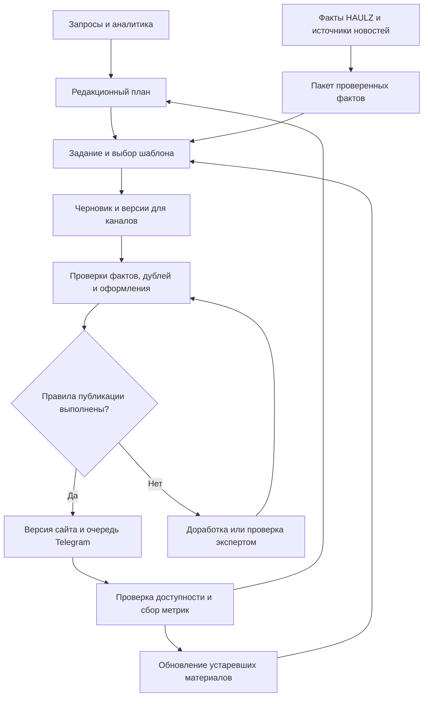

> Актуализация 01.10.2026: владелец подтвердил работу только с B2B. Упоминания частных перевозок и распределения 80/20 ниже — исторические предложения, сейчас не применяются.

# HAULZ: SEO, AEO, GEO и автономный контент-завод

**Версия:** 30.09.2026. **Статус:** план реализации; публикации, расписания и работающий сайт этим документом не изменены.

План объединяет три направления продвижения и отдельную производственную систему. Опирается на [аудит сайта](seo-geo-plan-2026-09-30.md), [снимок HTTP-проверок](audits/seo-live-2026-09-30.json), дополнительное чтение CMS, калькулятора, интеграций и официальных рекомендаций. Сведения о существующих функциях ниже подтверждены кодом; их фактическая настройка на сервере требует отдельной проверки.

## 1. Решение и порядок действий

**Цель:** получать квалифицированные заявки на перевозки Москва ↔ Калининград через обычный поиск, блоки ответов и рекомендации ИИ; превращать собственные знания компании в постоянно обновляемый публичный ресурс.

Порядок запуска:

1. **P0. Основа:** индексируемые страницы, единый основной домен, аналитика, проверенные сведения об услугах и ценах.
2. **P1. Спрос:** семантическое ядро, карта «потребность → страница», коммерческие страницы, полезные инструкции и блоки ответов.
3. **P1. Производство:** доработка имеющейся CMS до контент-завода; первый этап выпускает и обновляет материалы под утверждённое ядро.
4. **P2. Постоянная редакция:** второй этап добавляет мониторинг событий, новости сайта и Telegram; производство вечнозелёных материалов продолжается.
5. **P2. Цитируемость:** реальные кейсы, собственные данные, внешние публикации и подтверждение бренда. Начинать сбор доказательств с первой недели.
6. **P3. Инструменты ИИ:** развитие уже существующего MCP и публичного калькулятора для интеграций. Приоритет зависит от использования, а не от надежды на автоматическое ранжирование.

Техника, сбор ядра и сбор фактов идут параллельно. Масштабирование публикаций начинается после проверки качества первых материалов и исправления индексации.

**Приоритет подтверждён владельцем:** B2B — основной поток; частные перевозки, включая мотоциклы, — второй поток. Первоначально направлять около 80% редакционного ресурса на B2B и 20% на проверку частного спроса; это проектное распределение, которое пересматривается по заявкам и марже. Публиковать услуги частным клиентам только после подтверждения, что HAULZ их оказывает. Не смешивать их условия с B2B автоматически.

## 2. Три направления: задачи и результат

SEO, AEO и GEO пересекаются; у поисковых сервисов нет единого обязательного стандарта с такими тремя названиями. Используем их как три измеримых направления работы. Карты и локальная выдача входят в локальное SEO, хотя их ответы могут использоваться ассистентами.

| Направление | Потребность пользователя | Что делаем | Как измеряем |
|---|---|---|---|
| **SEO — поиск страниц** | «Перевозка мотоцикла Москва Калининград» | Индексация, архитектура, посадочные страницы, релевантные тексты, внутренняя навигация, скорость, внешние подтверждения | Небрендовые показы/переходы, позиции по группам, заявки и состоявшиеся перевозки |
| **AEO — получение прямого ответа** | «Сколько стоит и как подготовить мотоцикл?» | Краткие точные ответы, таблицы условий, расчёты, инструкции, единообразные факты, подходящая разметка | Наличие нашего источника в блоках ответов на контрольной выборке; переходы и заявки, где они доступны |
| **GEO — использование сайта генеративным поиском** | «Кого выбрать для перевозки мотоцикла и почему?» | Доступный контент, оригинальные доказательства, ясные условия применимости, авторство, кейсы, независимые упоминания | Цитаты со ссылкой, упоминания бренда отдельно, переходы из ИИ, квалифицированные заявки |

Попадание в ответ может не сопровождаться кликом. Упоминание HAULZ без ссылки, ссылка на статью и рекомендация заказать перевозку — три разных результата. Ни количество страниц, ни микроразметка не гарантируют включения в ответ.

### SEO: обязательная программа

- Основной домен выбрать по истории, ссылкам и аналитике. В коде сейчас основным указан `.space`; аудит показал дубли корней `.pro` и `.ru`. Не запускать массовое перенаправление API и рабочих кабинетов.
- Для публичных страниц отдавать основной текст и метаданные в первоначальном HTML; сохранить интерактивность калькулятора.
- Исправить soft-404, слеши, canonical, навигацию через обычные ссылки, согласовать sitemap и пагинацию.
- Сохранить полезные существующие адреса. Для новых услуг создать утверждённую структуру URL.
- Развести коммерческие страницы, инструкции, кейсы и новости. У каждого типа — собственный шаблон и задача.
- Проверить мобильную загрузку измерениями; оптимизировать выявленные узкие места.
- Актуализировать реальные филиалы, контакты, юридическое лицо, фотографии терминалов и способы обращения.

### AEO: обязательная программа

- На вопрос отвечать рядом с его заголовком: сначала вывод и условия, затем объяснение и пример. Длина определяется смыслом, а не «магическим» числом слов.
- Для цены показывать состав расчёта, параметры груза, включённые услуги, исключения и дату тарифной версии.
- Для сроков указывать точку отсчёта и условия; для инструкций — последовательность шагов; для сравнения способов — таблицу реальных различий.
- Согласовать FAQ, статьи, калькулятор, контакты и ответы сотрудников через общую базу фактов.
- Разметка Organization, Service, Article/NewsArticle, BreadcrumbList и филиалов должна соответствовать видимому содержанию и поддерживаемому типу страницы.
- **Не закладывать FAQ rich result Google в KPI:** показ этого формата прекращён с 7 мая 2026. Сами вопросы и ответы остаются полезными. [Изменения Google Search](https://developers.google.com/search/updates).
- Не обещать самостоятельное управление featured snippet: источник выбирает поисковая система. [Google о блоках ответов](https://developers.google.com/search/docs/appearance/featured-snippets).

### GEO: обязательная программа

- Дать ответам оригинальные основания: подтверждённый пример расчёта, фотографию упаковки, кейс, объяснение платного веса, проверяемые условия склада.
- Описать HAULZ как одну организацию: бренд, юридическое название, услуги, регионы, контакты и связанные официальные профили.
- Дополнять собственный сайт независимыми подтверждениями: реальные партнёры, клиентские кейсы, отраслевые редакции, профессиональные каталоги и отзывы.
- Проверить доступ поисковых роботов и защиту сайта. Для ChatGPT Search важен OAI-SearchBot; GPTBot для обучения управляется отдельно. [OpenAI](https://developers.openai.com/api/docs/bots).
- Вести контрольную выборку вопросов по Алисе, ChatGPT Search, Perplexity и Google/Bing; сохранять дату, режим, ответ и источник. Ответы отдельного Gemini-приложения не приравнивать к Google Search.
- Не считать публикацию в Telegram или наличие MCP самостоятельным доказательством индексации и цитируемости.

## 3. Что уже есть в HAULZ и что действительно нужно строить

| Уже есть в коде | Ограничение | Следующий шаг |
|---|---|---|
| `media_content_plans`, медиаплан, даты, каналы, административный интерфейс | Плана по датам недостаточно для автономного исполнения | Добавить задания, состояния обработки, журнал ошибок и расписание |
| Генерация статьи и Telegram/email-анонсов | Генератор получает brief и ключи; нет подтверждённого сбора источников и проверки фактов | Источники, факты, редакционное задание, проверки до публикации |
| `article_title`, description, slug, markdown | Один шаблон требует 1500–2500 слов и блок цены независимо от темы | Шаблоны по потребности; цены только из проверенного расчёта |
| Ручная публикация и публичный API блога | Нет отдельной опубликованной версии; повторная генерация переводит запись в draft | Версии: опубликованная остаётся доступной, новая редактируется отдельно |
| Поле каналов | Выборка блога не проверяет канал `site` | Независимые статусы публикации для сайта и Telegram |
| `/blog` и `/blog/:slug` | Клиентская загрузка; общий title статьи | Полный HTML, индивидуальные метаданные, даты, автор, источники |
| API sitemap | Ограничение выборки до 100 статей | Пагинация или индекс карт, контроль ошибок |
| Public API расчёта, маршруты, OpenAPI, `llms.txt` | Расчёт — ориентир «склад — склад», без забора и последней мили | Версии и срок актуальности данных; точное описание границ расчёта |
| `mcp/haulz-quote`: три инструмента | Это stdio-сервер для явно подключённого клиента; наличие размещённого публичного MCP не подтверждено | Проверить применение; внешнее размещение делать под конкретный сценарий |
| Обработчик расчёта для Алисы | Не доказано, что навык опубликован и активно используется | Проверить настройку/использование, не создавать обработчик повторно |
| Telegram-интеграции приложения | Уведомления не равны редакционному каналу | Отдельный издатель канала с правами, очередью и учётом отправок |

**Вывод:** расширяем существующую CMS. Полная замена сайта или отдельная тяжёлая CMS на первом этапе не нужны.

Ключевые исходники: `lib/mediaMarketing/{generateArticle,blogArticles,seoChecklistSeed}.ts`, `api/admin-media-plans*.ts`, `api/public-blog.ts`, `api/sitemap.ts`, `lib/haulzCalculator/publicEstimate.ts`, `mcp/haulz-quote/src/index.ts`, `public/openapi/public-quote.yaml`, `public/llms.txt`, `api/alice.ts`. Наличие кода не заменяет проверку публикации и доступности интеграции.

## 4. Семантическое ядро: как закрываем реальный спрос

### Процесс

1. **Инвентаризация:** реальные услуги, маршруты, типы грузов, ограничения, экономика заявки, существующие URL.
2. **Сбор спроса:** Wordstat по регионам и сезонности, Вебмастер, Search Console, обезличенные вопросы менеджерам, поиск по сайту и обращения клиентов. Разговорные вопросы ИИ — дополнительный слой; им не приписывается частотность Wordstat.
3. **Расширение:** направления × услуги × грузы × задачи. Это способ найти темы, а не команда создать все комбинации страниц.
4. **Группировка по намерению:** заказ, сравнение, расчёт, инструкция, поиск контактов. Проверить выдачу вручную для первых коммерческих групп; похожие слова не всегда означают одну задачу.
5. **Привязка к URL:** одна основная страница на одну потребность; дополнительные вопросы — разделы или связанные инструкции. Опечатки и синонимы не получают отдельные страницы.
6. **Приоритизация и план:** сначала востребованные и выгодные услуги, для которых уже есть факты и возможность выполнения.
7. **Обновление:** новые реальные запросы еженедельно; полноценный пересмотр ядра ежемесячно. Проверять, не конкурируют ли наши страницы за одну задачу.

[Wordstat](https://yandex.ru/support2/wordstat/ru/) показывает статистику запросов. Для автоматического сбора есть [официальный API с доступом и квотами](https://yandex.ru/support2/wordstat/en/content/api-wordstat); до подключения достаточно выгрузок. Доступ и частотности этим исследованием не получены.

**Результат первой итерации:** ориентировочно 200–500 исходных формулировок и 30–60 групп после проверки спроса. Это объём исследования, а не обнаруженная частотность и не обязательное число страниц.

Карточка группы: запросы; источник и дата данных; регион; аудитория; намерение; частотность с типом соответствия; сезонность; подтверждённая услуга; основная страница; связанные вопросы; факты; приоритет; ответственный; статус; показы; заявки. Синонимичные частоты не складывать как независимый спрос.

Предлагаемая оценка 0–5 по каждому признаку: `приоритет = 0,30 × ценность заявки + 0,25 × подтверждённый спрос + 0,20 × соответствие услугам + 0,15 × готовность доказательств + 0,10 × возможность улучшить выдачу`. Это внутренняя модель планирования, не формула поискового ранжирования. Неподтверждённая услуга блокирует публикацию независимо от балла.

### Начальная карта тем — гипотезы до замера спроса

| Группа | Основная потребность / страница | Поддерживающий материал | Приоритет |
|---|---|---|---|
| Москва → Калининград | Существующая страница направления | Что входит в перевозку, кейс | P1 |
| Калининград → Москва | Существующая обратная страница | Подготовка обратной отправки | P1 |
| Сборные грузы | Страница услуги | Расчёт платного веса | P1 |
| Стоимость перевозки | Тарифы + калькулятор | 3–5 воспроизводимых примеров | P1 |
| Забор по Москве/области | Страница забора | Как считаются зоны и расстояния | P1 |
| Доставка до адреса | Страница последней мили | Подъезд, разгрузка, ограничения | P1 |
| Приёмка в Москве | Страница московского склада | Проезд и подготовка документов | P1 |
| Приёмка в Калининграде | Страница калининградского склада | Часы и порядок сдачи | P1 |
| Упаковка/паллетирование | Страница услуги | Фото и выбор упаковки | P1 |
| Документы на груз | Инструкция | Различия для типов клиентов | P1 |
| Мотоцикл в Калининград | Специализированная услуга* | Подготовка + реальный кейс | P2, пилот второго потока |
| Мотоцикл обратно | Раздел или отдельная услуга* | Отличия обратного маршрута | По спросу |
| Мебель | Специализированная услуга* | Разборка, упаковка, габариты | P2 |
| Личные вещи/переезд | Специализированная услуга* | Опись и подготовка | P2 |
| Оборудование | Страница услуги* | Крепление, подъезд, погрузка | P2 |
| Запчасти | Страница услуги* | Упаковка и документы | P2 |
| Паллетные грузы | Услуга или раздел сборных грузов | Размеры, вес и расчёт | P1/P2 |
| Паром и автомобиль | Страницы способов, если они доступны | Сравнение условий | P1/P2 |
| Регулярные B2B-поставки | Решение для бизнеса | Документы, расписание, кейс | P1 |
| Срочная перевозка | Только подтверждённая услуга* | Условия применимости | По фактам |
| Ответственность/страхование | Условия услуги | Что покрывается и как обращаться | P1 по фактам |
| Отслеживание/документы | Публичная справка | Возможности личного кабинета | P2 |
| Сезонные ограничения | Актуальная новость + обновление услуги | Что меняется для отправителя | P2 |
| Итоги перевозок | Кейсы и агрегированные данные | Методика и границы выводов | P2 |

\* Наличие услуги, спрос и условия подтвердить. Не превращать предположение из этой таблицы в обещание клиенту.

### Пример: мотоцикл

- **SEO:** страница «Перевозка мотоцикла Москва — Калининград», синонимы «доставить/отправить/перевезти» объединены.
- **AEO:** блоки «Сколько стоит?», «Как упаковать?», «Какие документы?», «Заберёте ли из мотосалона?», с прямыми подтверждёнными ответами.
- **GEO:** кейс с фотографиями, параметрами груза и результатом; ясные условия и датированный расчёт, на который можно сослаться.
- **Связи:** направление → услуга → подготовка → кейс → калькулятор. Telegram получает полезную краткую версию и ссылку.
- **Расчёт:** существующий Public API не учитывает все условия такой перевозки. Нельзя выдавать его складской ориентир за полную стоимость с обрешёткой, забором и доставкой. Если данных нет — запрос параметров для расчёта, без придуманной цены.

## 5. Контент-завод: две стадии и постоянное обновление

### Стадия I — закрытие ядра, ориентир недели 3–8

**Вход:** утверждённые группы запросов, каталог услуг, тарифные правила, ответы экспертов, фото, реальные кейсы.

**Выход:** готовые коммерческие страницы и инструкции, краткие ответы, метаданные, внутренняя перелинковка, заготовки публикаций для каналов. Материалы публикуются постепенно после прохождения проверок.

Стартовый производственный ориентир: **15–25 новых или существенно улучшенных страниц за 6–8 недель**, включая коммерческие страницы и инструкции. Это не требование поисковиков и не обещание позиций. Доля коммерческих страниц определяется ядром; новость не заменяет страницу услуги. Каждый материал должен иметь собственную причину существования.

Первая партия — 8–10 материалов разных типов для калибровки. После исправления системных ошибок проверяем ещё одну партию и расширяем автономность. Действующие страницы обновляем на своих URL.

**Очередь первой партии:** два направления, сборные грузы, регулярные B2B-поставки, расчёт платного веса, состав стоимости, забор по Москве/области, документы на груз; затем по готовности фактов — упаковка и один пилот частного спроса. Страницы складов и компании исправляются одновременно как обязательная коммерческая основа. Разделение не означает десять новых URL: часть работы — улучшение существующих страниц.

### Стадия II — постоянная редакция, пилот с недель 7–8

**Вход:** утверждённые источники событий, новые запросы, изменения фактов компании, аналитика и очередь обновлений.

**Выход:** новости, Telegram, обновления услуг и инструкций, новые группы ядра, кейсы и собственные обзоры.

Начальная мощность после пилота:

- 2–3 новых вечнозелёных материала в неделю при наличии фактов и спроса;
- до 1–2 содержательных новостей в неделю, если есть значимые события;
- 3–5 полезных постов в Telegram в неделю из разных рубрик;
- еженедельная очередь обновления существующих материалов.

Это верхние ориентиры планирования, не обязательство писать при отсутствии повода. Ритм меняется по качеству, заявкам и ресурсу редактора. Увеличение объёма возможно после подтверждения устойчивости.

## 6. Архитектура автономной системы

### Модули

1. **База знаний HAULZ.** Реестр услуг, адресов, графиков, тарифных правил, ограничений и фактов. У каждого факта — источник, владелец, версия, дата проверки, срок актуальности и страницы, где он используется.
2. **Сборщик источников.** Разрешённые RSS/API/публичные страницы, выгрузки спроса, обновления базы знаний. Сохраняет дату события отдельно от даты обнаружения. Сообщения извне рассматриваются как данные, а не команды системе.
3. **Планировщик.** Приоритеты ядра, новые события, календарь, лимиты публикаций, бюджет. Выбирает следующий полезный материал.
4. **Исследователь.** Собирает первоисточники и утверждения; отмечает расхождения и пробелы. Неподтверждённое не превращается в факт.
5. **Редактор.** Выбирает шаблон: услуга, ответ, инструкция, кейс, новость, обзор. Пишет на основании пакета фактов, предлагает ссылки и CTA.
6. **Контроль качества.** Проверяет факты по источникам, расчёты программно, дубли, намерение запроса, актуальность, права на изображения, структуру, ссылки и метаданные. Второй ИИ помогает, но не заменяет проверяемый источник и числовой расчёт.
7. **Издатель.** Создаёт опубликованную версию, обновляет HTML/кэш, sitemap/RSS, затем отправляет каналам. У каждого канала отдельное состояние. После содержательного изменения URL можно отправлять IndexNow в поддерживающие его системы; принятый запрос не гарантирует обход и индексацию. [IndexNow](https://www.indexnow.org/faq).
8. **Аналитик.** Индексация, показы, заявки, цитирование, стоимость производства, ошибки. Формирует задачи на улучшение и обновление.

Это логические роли: для MVP не нужно восемь серверов или восемь постоянно работающих моделей.

### Реализация в существующем стеке

Использовать имеющийся TypeScript backend и PostgreSQL, расширить `media_content_plans`. Добавить сущности: `content_clusters`, `content_sources`, `content_facts`, `content_revisions`, `content_jobs`, `channel_publications`, `content_observations`. Названия проектные; окончательная схема определяется при реализации.

- Отдельный worker-процесс контент-завода, отдельная очередь и лимит подключений к БД. На старте допустим тот же сервер при достаточном ресурсе, но отдельный процесс и квоты; размещение решается по измерениям.
- Длительная генерация выполняется заданиями, а не удерживает HTTP-запрос административной панели.
- Сохранять переходы состояния, попытки, стоимость, источники и версию правил. После перезапуска продолжать незавершённые задания.
- Версия сайта и черновик разделены: повторная генерация не снимает статью с публикации.
- Текущая CMS публикует статьи по `/blog/:slug`. Для коммерческих страниц добавить тип материала, канонический путь и выбор шаблона/маршрута; сохранить существующие адреса направлений. Без этого завод сможет написать текст услуги, но не опубликовать запланированную посадочную страницу.
- Публикация атомарно меняет активную версию. Смена slug требует перенаправления, обычное редактирование сохраняет URL.
- Переключение активной версии и постановка связанной публикации Telegram в исходящую очередь выполняются в одной транзакции БД. Перед отправкой поста издатель проверяет публичный HTTP-ответ и содержание страницы; при ошибке прогрева HTML/кэша доставка поста ждёт исправления.
- Сервер проверяет правила публикации; обход интерфейса не должен их обходить.
- Для фонового издателя — отдельные ограниченные права. Учётные данные 1С и суперадминистратора ему не нужны.
- **Ноль прямых обращений контент-завода к 1С.** Разрешённые обезличенные сведения и расчёты — из подготовленной базы/снимков тарифов. Никаких новых заданий refresh-cache на каждую статью.
- Начать с одного задания генерации одновременно; менять лимит по измеренной нагрузке. Раздельные лимиты на источники, модель и Telegram.
- Реестр расходов и месячный лимит. При превышении лимита новые генерации ждут; опубликованный сайт продолжает работать.
- Публикации имеют ключ `материал + версия + канал`. Telegram Bot API не обещает прикладную exactly-once-доставку: после таймаута с неизвестным результатом не повторять вслепую, сначала сверить отправку или передать её на проверку.

## 7. Автономность: что публикуется без человека

Рекомендуемая политика после пилота; сейчас она не включена.

| Категория | Автономное действие | Когда нужен человек |
|---|---|---|
| Обновление известного адреса/графика из утверждённой записи | Обновить связанные блоки и канал в рамках заданных правил | Конфликт источников или новая политика работы |
| Инструкция по уже утверждённым условиям | Подготовить, проверить и опубликовать | Нет необходимого факта, новая услуга/обещание |
| Цена | Пересчитать утверждённый пример детерминированным калькулятором, сохранить параметры и версию | Полный состав услуги неизвестен, скидка или индивидуальный тариф |
| Новость из утверждённого первоисточника | Краткое изложение, дата, ссылка, фактическое влияние | Спорное влияние, новые юридические/таможенные трактовки, неподтверждённая отмена/задержка |
| Telegram-версия опубликованного материала | Подготовить и отправить по расписанию | Есть новые факты, которых нет в проверенной версии |
| Кейс | Собрать черновик по разрешённым материалам | Первая публикация сведений клиента, согласование фактов/фото |
| Собственный аналитический обзор | Посчитать агрегаты и подготовить черновик | Методика и выводы первого выпуска, недостаточная выборка |

После согласования правил владелец не подтверждает каждый типовой материал. Система сообщает об исключениях. Непрошедший материал остаётся в очереди до исправления; остальные задания продолжают работу.

**Проверки перед публикацией:**

- услуга и аудитория подтверждены;
- существенные утверждения имеют источник/запись в базе знаний;
- даты и тарифные версии актуальны;
- цена воспроизводится с теми же параметрами, единицами и составом услуг;
- материал отвечает выбранной потребности и не дублирует существующий;
- персональные данные клиента не попали в публикацию;
- у изображений есть право использования; иллюстрация не выдаётся за фото реального груза;
- URL, метаданные, внутренние ссылки, HTML и JSON-LD проверены;
- есть контроль опубликованного результата и возможность отката.

Google допускает полезное применение генерации, но масштабное создание страниц без дополнительной ценности может нарушать правила. Поэтому производственный KPI — полезный проверенный материал и заявка, а не число слов. [Google о генеративном контенте](https://developers.google.com/search/docs/fundamentals/using-gen-ai-content).

## 8. Новостной блок: редакционная политика

### Источники

Сформировать реестр официальных сайтов и доступных лент операторов маршрутов, терминалов, региональных органов, профильных ведомств и собственной операционной команды. Конкретный перечень проверяется при подключении: доступность, права использования, частота обновления, ответственность за факты. Чужой Telegram-канал не считать автоматически доступным для чтения нашим ботом.

Отраслевые СМИ — дополнительный источник и сигнал для поиска первоисточника. Перепечатки одного сообщения не считаются независимыми подтверждениями.

### Что публиковать

- изменения, влияющие на отправку или получение груза;
- графики работы и приёмки, подтверждённые ответственным;
- разъяснения изменившихся процедур;
- новые реальные услуги, терминалы и возможности;
- сезонные рекомендации и результаты собственных исследований.

Для каждого события отвечать: **что произошло → кого касается → с какой даты → что делать отправителю → источник и время проверки**. Факт события отделять от нашей оценки влияния.

Если событие меняет условия услуги, кроме новости обновляется соответствующая постоянная страница. Развитие одного события ведётся обновлениями, без серии почти одинаковых URL. Даты обновления меняются только при содержательном изменении. Историческая новость сохраняет контекст; массовое удаление/закрытие архива не планируется.

Предлагаемый старт: проверка источников дважды в рабочий день по Москве, группировка дублей ежедневно, обзор очереди обновлений еженедельно. Это проект расписания, не уже созданная автоматизация. При недоступности источника сохраняется ошибка; новость не сочиняется.

## 9. Telegram: самостоятельная польза и связь с сайтом

На сайте хранится полная доступная версия материала. Пост в Telegram даёт полезный самостоятельный вывод, конкретный пример или короткую инструкцию и при необходимости ссылку. Не ограничивать канал одинаковыми тизерами «читайте на сайте».

Рубрики: ответ логиста, разбор цены, упаковка на примере, реальный кейс, важное изменение, новости HAULZ. Можно адаптировать один проверенный пакет фактов в статью, пост, карточку, короткое видео и материал для партнёров; новые форматы не должны добавлять непроверенные факты.

**Технически:** бот-издатель с правами в нужном канале; очередь; предпросмотр; отдельные статусы; сохранённый `message_id`; изменение опубликованного сообщения; метки кампании и материала; защита от дублей. [Telegram Bot API](https://core.telegram.org/bots/api).

Исправление существенной ошибки проводится и на сайте, и в связанном посте. Для важных исправлений — понятное уведомление читателю. Просмотры поста, переходы и заявки считаются отдельно. Telegram не даёт гарантии появления текста в ответах ИИ; сайт остаётся основным управляемым публичным источником.

## 10. Каналы и возможности расширения

| Возможность | Что получаем | Когда |
|---|---|---|
| Яндекс/Google: коммерческие страницы | Заявки по прямым запросам | P0–P1 |
| Прямые ответы и инструкции | Покрытие вопросов перед заказом, возможные блоки ответов | P1 |
| Яндекс Бизнес и реальные филиалы | Локальный спрос, подтверждение адресов | P1 |
| Кейсы и фотографии упаковки/приёмки | Доказательства возможностей, материалы для ссылок | P1–P2 |
| Оригинальные калькуляторы и примеры | Интерактивная польза и воспроизводимые ответы | P1–P2 |
| Telegram | Повторные контакты, распространение, заявки | P2 |
| Публичные исследования HAULZ | Причины ссылаться на компанию как источник | P2 после накопления данных |
| Отраслевые медиа и партнёры | Независимые упоминания и целевые переходы | P2 |
| Видео/фотоинструкции | Дополнительные форматы поиска и объяснения | P2 после базовых страниц |
| Email/VK/Дзен | Дополнительное распространение там, где есть аудитория | P3, отдельный эксперимент |
| MCP/Public API/навык Алисы | Выполнение расчёта в подключённом интерфейсе | P3 или выше при подтверждённом использовании |
| `llms.txt` | Машиночитаемый справочник для использующих его клиентов | Поддерживать существующий, не считать рычагом ранжирования |

Пример собственной аналитики: фактический срок на выбранном участке маршрута или состав стоимости типовых отправок. Нужны методика, период, размер и ограничения выборки, обезличивание. Публиковать только разрешённые агрегаты; не представлять наблюдение HAULZ как статистику всего рынка.

Партнёрские публикации и экспертные комментарии готовятся редакцией; внешняя рассылка и размещение запускаются отдельной согласованной кампанией. Фиктивные отзывы и скрытая имитация независимых рекомендаций в план не входят.

**MCP:** код уже существует, создавать заново не требуется. Сначала проверить полноту расчёта и потребность конкретной интеграции. Для внешнего подключения могут понадобиться подходящий транспорт, размещение, лимиты, документация и наблюдение. Сам MCP не сообщает всем нейросетям о компании. Индексацию сайта ведём независимо.

## 11. Очередь реализации и критерии готовности

| ID | Приоритет | Работа | Зависимость | Приёмка |
|---|---|---|---|---|
| T01 | P0 | Базовые метрики и инвентаризация услуг | Доступы/ответственный | Зафиксированы источники заявок, услуги и бизнес-цели |
| T02 | P0 | Основной домен, canonical, редиректы | История доменов | Один канонический публичный URL; интеграции работают |
| T03 | P0 | Готовый HTML, 404, ссылки, sitemap | Матрица маршрутов | Контент читается без JS; нет soft-404 на контрольных URL |
| T04 | P0 | База фактов и правила публикации | Эксперт компании | У каждого ключевого факта есть источник/владелец/актуальность |
| T05 | P1 | Ядро и карта URL | Спрос + T04 | Каждая выбранная группа имеет основную страницу |
| T06 | P1 | Типы контента, маршруты и шаблоны SEO/AEO/GEO | T05 | Услуга и статья публикуются по нужным URL; шаблон покрывает цель, ответ, доказательство и CTA |
| T07 | P1 | Версии, редактор/предпросмотр, каналы, серверная валидация CMS | Модель данных | Перегенерация не скрывает живую статью; TG-only не попадает в блог |
| T08 | P1 | Очередь, источники, генерация, проверки | T04, T06, T07 | Задания восстанавливаются; непроверенные материалы удерживаются |
| T09 | P1 | Пилот 8–10 материалов | T03, T08 | Факты сверены, страницы доступны, ошибки исправлены |
| T10 | P1 | Производство первой волны | T09 | 15–25 качественных новых/улучшенных страниц по приоритету |
| T11 | P2 | Мониторинг новостей и обновлений | Реестр источников | На тестовых событиях корректны даты, дубли и источники |
| T12 | P2 | Издатель Telegram | Права канала + T07 | Отправка/редактирование/ошибки проверены; нет слепых повторов |
| T13 | P2 | Отчёты SEO/AEO/GEO и экономика | T01 | Отдельно индекс, ответы, цитаты, переходы и заявки |
| T14 | P2 | Кейсы, исследование, внешние материалы | Подтверждённые данные | Опубликованные доказательства и проверяемые источники |
| T15 | P3 | MCP и дополнительные каналы | Использование/экономика | Проверен реальный сценарий и измеряется его результат |

### Сроки и ресурсы

| Период | Основной результат |
|---|---|
| Неделя 1 | Базовая аналитика, выбор домена, подтверждение услуг, первый срез ядра; проект базы фактов |
| Недели 2–3 | Техническая индексация и шаблоны; CMS с версиями и независимыми каналами |
| Недели 3–4 | Контент-завод MVP и первая партия; измерение качества и стоимости |
| Недели 5–8 | Первая волна ядра; запуск пилота новостей и Telegram |
| Недели 9–12 | Постоянная редакция, очередь обновлений, кейсы, внешние публикации и отчёт по результату |
| Месяцы 4–6 | Расширение только успешных групп, оригинальная аналитика и полезные дополнительные интеграции |

Плановые оценки: 15–25 человеко-дней разработки для техники и MVP завода; ещё 5–10 для устойчивого новостного/Telegram-контура и отчётов. Уточнить после проектирования и проверки инфраструктуры. SEO/редактор — около 8–12 часов в неделю на запуске; эксперт-логист — 2–4 часа в неделю, владелец — на исходные правила и исключения. Роли могут совмещаться, но ответственность за факты нужна конкретному человеку.

Бюджет считать отдельно: разработка + редактор/эксперт + источники спроса + модель/поиск + инфраструктура + подготовка фото/кейсов + внешнее распространение. Цены подрядчиков и моделей здесь не оценивались. После 10 пилотных материалов измерить стоимость одобренного материала с учётом неудачных попыток и обновлений; по ней утвердить месячный лимит. Автономность уменьшает рутину, но не отменяет ответственность за сведения компании.

## 12. Измерение эффекта и правила масштабирования

**Главная метрика:** квалифицированные заявки и маржинальный результат перевозок из органики/ИИ/контентных каналов. Не выдавать неподтверждённый источник за точную атрибуцию.

| Уровень | Метрики | Частота |
|---|---|---|
| Техника | Доступность, canonical, индексируемость, ошибки sitemap, скорость | Автопроверки + еженедельный обзор |
| SEO | Индекс, показы, небрендовые клики, группы запросов, конверсия | Еженедельно; решения по накопленным данным |
| AEO | Ответы с нашим источником на фиксированной выборке | Раз в неделю/месяц, с фиксацией условий |
| GEO | Упоминания, ссылки, рекомендации, рефералы и заявки раздельно | Еженедельно/ежемесячно |
| Telegram | Просмотры, переходы, заявки, рост аудитории | По публикациям и неделям |
| Завод | Материалы прошли проверку, доля доработки, стоимость, задержки, ошибки, просроченные факты | Еженедельно |
| Бизнес | Квалифицированные обращения, расчёты, заказы, маржа | Ежемесячно |

Использовать отчёты [Алисы в Яндекс Вебмастере](https://yandex.ru/support/webmaster/ru/service/alice-answers), доступные отчёты Search Console и [Bing AI Performance](https://www.bing.com/webmasters/help/ai-performance-9f8e7d6c). Отчёт [Google Generative AI performance](https://support.google.com/webmasters/answer/16984139?hl=en) показывает показы ссылок в соответствующих AI-функциях; не приравнивать их к кликам или заявкам. [Переходы из ChatGPT](https://help.openai.com/en/articles/12627856-publishers-and-developers-faq) учитывать отдельно от цитирования.

Контрольная выборка — 40–60 вопросов: прямой заказ, цена, ограничения, сравнение, подготовка, терминалы, выбор подрядчика; оба направления, B2B и частные сценарии отдельно. Сохранять сервис, дату, регион/язык, режим поиска, формулировку, ссылку и результат. Доля ответов со ссылкой — показатель именно этой выборки, не всего рынка. Не публиковать персональные данные в тестовых вопросах.

**Условия расширения:**

- Техническая готовность: все приоритетные URL проходят проверки HTML/canonical/статуса. Сам факт прохождения не гарантирует индексирование.
- Качество: первая партия сверена с источниками; новая проверочная партия не содержит критических фактических ошибок. Это необходимая проверка, не доказательство будущей безошибочности.
- Автономность: успешно проверены недоступный источник, конфликт фактов, перезапуск worker, повтор задания, неизвестный результат отправки и откат версии.
- Экономика: известна стоимость материала, накоплены данные по поиску и заявкам. При слабой индексации сначала разбор причины, а не увеличение выпуска.

Правила действий: есть показы, нет кликов → проверить соответствие намерению и сниппет; есть клики, нет заявок → условия, доверие, расчёт и CTA; нет индекса → техническая доступность, дубли и полезность; ИИ цитирует без заявок → оценить роль материала и связанные коммерческие переходы. Не переписывать материал ежедневно по колебаниям одного ответа.

## 13. Решения перед реализацией

Нужны четыре набора исходных данных:

1. Основной домен и доступ к статистике поиска/заявок.
2. Подтверждённые услуги и условия перевозки мотоциклов и других специальных грузов. Приоритет аудитории уже определён: B2B, затем частные перевозки.
3. Ответственный за факты, начальная база знаний, фото/кейсы и политика автоматической публикации.
4. Адрес целевого Telegram-канала, права бота при запуске, лимит бюджета и список источников новостей.

Это зависимости реализации, не повод задерживать проектирование и сбор публичной семантики. На этом этапе подготовлен план; подписки на платные сервисы, внешние публикации и фоновые задачи не запускались.

**Первый спринт:** T01–T05 параллельно, проект T07–T08; далее пилот T09. Такой порядок даёт измеримую основу, проверенный первый контент и возможность перейти к постоянной редакции без повторной разработки.
