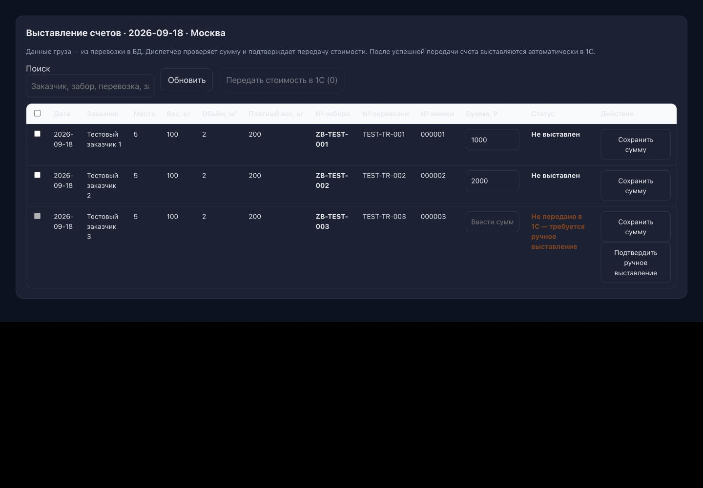

# UX/UI-аудит HAULZ

> Это исходный аудит. Ход исправлений и ограничения приёмки: [план реализации](ux-improvement-plan.md#выполнение--19-сентября-2026).

Дата: **18–19 сентября 2026**. База: **main, b192f409** (`feat(documents): add smooth animated section tabs`). Аудит текущего кода и изолированного интерфейса, а не заключение о состоянии production.

## Резюме

Новые находки: **29** — **P0: 0; P1: 8; P2: 18; P3: 3**. Из них **12 подтверждены**, **11 — риски кода**, **3 — пользовательские гипотезы**, **3 — предложения по дизайну**. Подтверждение бывает браузерным или однозначным сопоставлением текущего UI с обработчиком; источник указан ниже. Открытые пункты старого `todo.md` в эти числа не включены.

P0 оставлен для критической блокировки/потери сохранённых рабочих данных: такого нового факта аудит не установил. Потеря ещё не сохранённого ввода оценена P1 и входит в первый этап. Это не снижает срочность сохранения черновиков.

Пять главных выводов:

1. **Защита ввода не едина:** сохранение одной суммы стирает другую, закрытие карточки — номер заявки, выход из формы — новую заявку.
2. **Ошибка сети может выглядеть как бизнес-результат:** «все счета оплачены» и «заявок нет» появляются без успешного чтения.
3. **Действие оформления описано неверно:** UI обещает согласование до 1С, backend создаёт заявку сразу.
4. **Доступность — функциональная проблема:** карточки профиля не доступны с клавиатуры, финансовая таблица в dark имеет контраст заголовков около 1.18:1.
5. **Визуальная неоднородность имеет системную причину:** три слоя токенов, локальные стили и разные контракты форм/диалогов. Smooth Tabs можно развивать, но они не устраняют эти расхождения.

Начать с защиты ввода и достоверности состояний, затем унифицировать общие компоненты. Подробная последовательность — [план исправлений](ux-improvement-plan.md).

## Метод и границы доказательства

- Прочитаны маршрутизация, UI-компоненты, тематические стили, связанные обработчики API, документация и `todo.md`.
- Создан временный стенд вне исходников приложения: реальные React-компоненты, синтетические заборы/маршрут/счета и подменённые ответы чтения. Сохранение суммы работает только в памяти стенда. CSP запрещает внешние соединения; операции записи в 1С не выполнялись.
- Выполнены **78 рендеров: 13 экранов × 390/768/1440 px × light/dark**. В измеренных начальных состояниях нет горизонтального переполнения всего документа и ошибок границы стенда. Это не гарантия для всех вложенных таблиц и наполненных экранов.
- Проверены отдельные переходы, несохранённый ввод, accessibility tree, computed styles и ответы 503. Сохранены 16 снимков и JSON-доказательства.
- Standalone-компоненты подключены к общей теме, но **полный App-header/TabBar не отрисовывались**. Наложения глобальных sticky-панелей, нативная клавиатура, safe area, реальные жесты/связь/GPS и рабочие роли требуют следующего прохода.
- CMS и guest в приложении принудительно светлые. Их dark-рендеры — техническая проверка компонентов, а не подтверждение доступности такого режима пользователям.
- `.env`, рабочая БД и серверы не читались; аккаунты/права и рабочие данные не менялись. Типизация и полный e2e не объявляются пройденными.

[Измерения 78 рендеров](ux-audit-assets/responsive-checks.json) · [протокол стенда и ограничения](ux-audit-assets/README.md).

## Карта приложения

| Область | Экраны и основные действия | Роли / ограничения |
| --- | --- | --- |
| Вход и публичная часть | Вход, восстановление, гостевые маршруты, калькулятор, склады, FAQ, блог, скачивание приложения | Гость; зарегистрированный пользователь. Реальный вход и 2FA не выполнялись |
| Главная | Показатели, ЭДО, задолженность, план/факт, фильтры периода и маршрута | Клиент; дополнительные аналитические права |
| Грузы / перевозки | Карточки/таблица, фильтры, подробности, статусы, показатели и стоимость | Область доступа выбранной компании; служебный режим расширяет UI |
| Документы | ЭДО, счета, УПД, заявки, претензии, договоры, сверки, тарифы; таблицы, детализация и выгрузки | Отдельные права `doc_*`; доступ определяется разрешёнными разделами |
| Новая заявка | Отправитель → маршрут/ПВЗ → места/файлы → расчёт → номер/дата → оформление | Клиент с `doc_orders`; сервер проверяет область доступа и входные данные |
| HAULZ / диспетчер | День, заборы, маршруты, назначение, ручная отметка, номер заявки, расчёты, мониторинг, история | `dispatcher`; создание, редактирование, удаление по действующим правилам |
| Водитель | Главная/текущий день, маршрут, порядок точек, отметки/фото/места, сдача, профиль/обновление | `driver`; назначенные маршруты и устройства |
| Справочники pickup | Водители, транспорт, контакты, связанные пользователи и параметры ТС | Диспетчер/администратор; отдельные сущности от авторизации |
| Профиль | Компании, роли, сотрудники, 2FA, уведомления, HAULZ, версия, FAQ, документы согласий | Условные пункты по правам; основное меню общее |
| Расходы / бухгалтерия | Заявка на расход, список/фильтры, согласование, вложения; календарь/табель/ФОТ | Сотрудник, бухгалтер, руководитель, администратор |
| WB, возвраты, внутренние инструменты | Описи/претензии/сводная, импорт возвратов, сохранённые обработки, аналитика, песочницы | Отдельные `wb`, `red_returns`, `analytics`, `haulz` и служебные права |
| CMS | Пользователи/права, заказчики, поставщики, ПВЗ, тарифы, сотрудники, договоры/сверки, расходы, интеграции, логи и аудит | `cms_access`; часть прав может менять только суперадминистратор |

Источники: [права CMS](../src/features/admin/lib/permissions.ts), [главное содержимое](../src/components/AppMainContent.tsx), [меню профиля](../src/features/profile/sections/ProfileMainSection.tsx), [нижняя навигация](../src/components/TabBar.tsx). Это карта найденных поверхностей; она не подтверждает серверную авторизацию каждого действия.

### Общие компоненты и повторяющиеся правила

- `Button`, `Panel`, `Typography`, `TapSwitch`, фильтры и селекты используются рядом с native HTML и локальными inline-стилями.
- `GuardedDialog` сосуществует с native dialog и div-оверлеями; гарантии dirty/focus различаются.
- Клиентская нижняя навигация и навигация водителя уже имеют доступное текущее состояние; проблема не в отсутствии `aria-current` у TabBar.
- Общий `ErrorBoundary` и локальные fallback разошлись; AsyncState для error/empty также не везде одинаков.
- `theme.css`, `design-tokens.css`, `profile-saas.css` и `--pk-*` образуют несколько слоёв дизайна.

## Таблица покрытия

Обозначения: **Б** — браузер на тестовых данных; **К** — чтение кода; **—** — не проверено. Б не означает живую интеграцию.

| Раздел | Код | 390 / 768 / 1440, обе темы | Проверенные состояния/действия | Недостающая проверка |
| --- | --- | --- | --- | --- |
| Диспетчеризация | К | Б / Б / Б | 6 заборов разных статусов, маршрут, карточка, потеря номера при закрытии | 20 точек, конкурентное изменение, реальное назначение/удаление |
| Водитель | К | Б / Б / Б | Главная дня, прогресс, нижнее меню, структура маршрута | Физические iOS/Android, фото, связь, перестановка и GPS в фоне |
| Счета pickup | К | Б / Б / Б | 3 строки, две правки, сохранение одной, dark-цвета | Реальная передача, неопределённый ответ, подтверждение ручного выставления |
| Документы | К | Б / Б / Б | Навигация, пустые разделы, stale, новая форма, возврат, 503 в заявках | Все наполненные журналы, вложенные посылки, экспорт, договоры/сверки по ролям |
| Перевозки | К | Б / Б / Б | Основная оболочка/карточка, фильтры, empty/503 | Наполненный большой список, документы/экспорт и реальные связи |
| Главная | К | Б / Б / Б | Начальный/пустой экран, ошибка 503, ложный вывод об оплате | Реальные долги и объёмы, изменения выбранной компании |
| Профиль | К | Б / Б / Б | Основное меню и дерево доступности | Все вложенные формы, смена ролей/компаний в полном App |
| CMS | К | Б / Б / Б* | Начальная оболочка, пустые данные | Полные записи всех справочников, клавиатура вложенного переключателя, реальные права |
| Справочники водителей/ТС | К | В составе pickup; формы отдельно не прогнаны | Состав форм и связь с модулем | CRUD на разрешённой тестовой БД, уникальность/архивные записи |
| Расходы | К | Б / Б / Б | Пустой список и игнорирование 503 | Наполненный цикл согласования, вложения, роли бухгалтерии |
| WB | К | Б / Б / Б | Пустой список, ошибка и empty одновременно | Выгрузки на устройствах — UX-02; наполненные таблицы |
| Возвраты | К | Б / Б / Б | Список сессий, empty/503 | Реальный тестовый XLSX, обработка и восстановление сессии |
| Калькулятор | К | Б / Б / Б | Начальная форма, адаптивный рендер | Реальные тарифы/ПВЗ, все направления и крайние значения |
| Вход | К | Б / Б / Б* | Рендер формы, подписи | Реальный вход/2FA/восстановление, биометрия и системные диалоги |
| Гостевые страницы, аналитика/табели/интеграции | Карта и выборочные общие компоненты | — | Выявлено наличие и точки входа | Отдельный контентный и сценарный проход |
| Полный App / native | К | — | Код shell, переключения темы, обновлений | Глобальные sticky, экранная клавиатура, safe area, hardware back, слабое устройство |

\* В production CMS/guest могут принудительно использовать light; dark на стенде не трактуется как пользовательский дефект этих экранов.

## Ключевая цепочка pickup → 1С

| Шаг | Текущее правило | Оценка / следующий шаг |
| --- | --- | --- |
| Создание забора | Заказчик, отправитель, груз, адрес/окна, место выгрузки и расчёты — отдельные блоки | Понятная структура; не возвращать удалённые по запросу поля смен/доступности и блок «Въезд» |
| Назначение / публикация | Работа диспетчера с маршрутом и версиями | Проверить актуальные данные водителя при изменении версии; UXA-02 |
| Выполнение | Отметки, места, фото, проблемный/частичный забор и локальная очередь | Базовый мобильный сценарий есть; PICK-03/05 и UXA-21 требуют устройств |
| Сдача | Номер заявки требуется для сдаваемых заборов; диспетчер имеет ручной сценарий | Уже реализованное правило сохранить; проверять сервер, а не только кнопку |
| Номер → 1С | Локальная запись и отдельная синхронизация | Отличать «сохранено в HAULZ» от «номер передан в 1С», показывать сбой очереди |
| Попадание в счета | `deposited` и `issueCustomerBill===true` | Корректный отбор; UXA-12/22 объясняют конфликт UI и обнаруживаемость |
| Сумма | Ручная/авто; данные перевозки из БД | Сначала UXA-01/10/11; не делать фиктивный авторасчёт при отсутствии данных |
| Передача стоимости | Подтверждение диспетчера; успех = «Передано в 1С» | Верная семантика в текущем журнале; не заменять успех на «счёт выставлен» |
| Неопределённый результат | Сверка вместо безусловного повтора | Сохранить защиту API-03, дополнить прогрессом UXA-28 |

Не предлагать восстановить запрет удаления активного маршрута: пользователь ранее разрешил удаление на любом этапе. Проверять ясность последствий/подтверждение, а не менять принятое правило.

## Реестр новых находок

S — обычно до одного рабочего дня; M — 2–4 дня; L — от 5 дней или несколько подсистем. Это оценка масштаба, не срок обещанного выпуска. Подробные условия и доказательства — по ID ниже.

| ID | Приоритет | Раздел/роль | Проблема | Доказательство | Влияние | Рекомендация | Трудоёмкость | Критерий приёмки |
| --- | --- | --- | --- | --- | --- | --- | --- | --- |
| [UXA-01](#uxa-01) | P1 | Расчёты / диспетчер | Сохранение строки стирает несохранённые суммы других строк | Подтверждено | Теряется введённая диспетчером стоимость; повторная проверка и риск передачи старой суммы. | Разделить серверные строки и черновики по jobId/version. Обновлять сохранённую строку; при конфликте предлагать сравнение. Отмена не должна вызывать перезагрузку. | M | После сохранения первой строки значение 2222 и выделение второй сохраняются; отмена передачи не меняет ввод. |
| [UXA-02](#uxa-02) | P1 | Карточка забора / диспетчер | Закрытие карточки теряет новый номер заявки; версия может сбросить редактор | Подтверждено | Повторный ввод и пропущенная связь забора с заявкой. | Добавить состояние dirty и защиту всех способов закрытия; держать черновик по ID, сверять базовую версию при сохранении. | M | Закрытие кнопкой, Escape и фоном защищено; новая серверная версия не стирает черновик и не перезаписывается молча. |
| [UXA-03](#uxa-03) | P1 | Новая заявка / клиент | Возврат в журнал уничтожает заполнение заявки | Подтверждено | Повторное заполнение длинной формы, особенно после прикрепления файлов и добавления мест. | Общий dirty-guard плюс черновик, изолированный по аккаунту/компании. Политику хранения файлов согласовать с SEC-08. | M | Возврат, смена раздела и перезагрузка имеют определённый сценарий восстановления; чужая компания не получает черновик. |
| [UXA-04](#uxa-04) | P1 | Профиль / все роли | Основные карточки профиля недоступны с клавиатуры | Подтверждено | Клавиатурный пользователь не может открыть основные рабочие разделы. | Использовать семантические ссылки/кнопки; не вкладывать кнопку удаления в другую кнопку. | S | Tab достигает каждого пункта, Enter открывает нужный экран, фокус виден и возвращается после возврата. |
| [UXA-05](#uxa-05) | P1 | Главная / клиент, бухгалтер | Ошибка загрузки превращается в сообщение «все счета оплачены» | Подтверждено | Недостоверный финансовый вывод может повлиять на решение пользователя. | Передавать состояние конкретного запроса в монитор; показывать «Не удалось проверить задолженность», повтор и время снимка. | M | При 503 и до завершения первого запроса нет утверждения об оплате; успешный пустой ответ ограничен указанным периодом. |
| [UXA-06](#uxa-06) | P1 | Заявки на расходы / сотрудник | Сбой загрузки списка скрывается как отсутствие заявок | Подтверждено | Пользователь может повторно создать уже существующий запрос или считать расходы отсутствующими. | Хранить listError, сохранять предыдущий снимок с отметкой устаревания; повторять именно чтение. | S | При сбое видна ошибка и «Повторить», итог не представлен как достоверный ноль; восстановление сети возвращает список. |
| [UXA-07](#uxa-07) | P1 | Выставление счетов / тёмная тема | Заголовки финансовой таблицы почти не читаются | Подтверждено | Трудно сопоставить сумму, номер и показатели груза; возрастает риск ошибки при проверке. | Заменить hardcoded фоны и fallback статусов на семантические токены; проверить обычное и hover-состояния. | S | Обычный текст ≥4.5:1 в обеих темах; строка и заголовок читаемы при hover, фокусе и выборе. |
| [UXA-08](#uxa-08) | P1 | Оформление заявки / клиент | Обещание согласования противоречит фактической отправке в 1С | Подтверждено | Пользователь подтверждает действие, ожидая другого последствия. | Согласовать тексты с текущим прямым созданием. Не возвращать промежуточное согласование без отдельного продуктового решения. | S | Форма, подтверждение, результат и журнал описывают одну цепочку: создано в 1С → без проведения → обновление данных по расписанию. |
| [UXA-09](#uxa-09) | P2 | Новая заявка / клиент | Обязательный номер заявки помечен как необязательный | Подтверждено | Поздняя ошибка и лишний шаг; пользователь может менять номер при повторе. | Исправить подпись, required и maxLength; объяснить защиту от повторного создания. | S | Пустое значение отмечается у поля; корректный номер сохраняется при повторе операции. |
| [UXA-10](#uxa-10) | P2 | Передача стоимости / диспетчер | Проверка несохранённых сумм происходит после подтверждения передачи | Риск кода | Путаются сумма подтверждения, ошибка валидации и статус интеграции. | До подтверждения блокировать несохранённые строки с адресной подсказкой; разделить validation / failed / uncertain / transmitted. | M | До HTTP-вызова показана точная сумма; локальная ошибка не переводит строку и сообщение в «ручное выставление». |
| [UXA-11](#uxa-11) | P2 | Редактирование расчётов / диспетчер | Форма предлагает редактировать расчёты, которые сервер уже блокирует | Риск кода | Диспетчер вводит данные и узнаёт о запрете только после сохранения. | Передать в карточку canEditBilling и причину, оставить переход в журнал для сверки. | M | Для transmitted/uncertain/sending интерфейс заранее объясняет ограничение; разрешённый not_issued редактируется. |
| [UXA-12](#uxa-12) | P2 | Расчёты забора / диспетчер | Наследуемое правило включает счёт вопреки явному false | Риск кода | Переключатель показывает включённый счёт, но запись исключена из журнала. | Разделить отсутствующее поле и false в нормализации; проверить реальные legacy-данные отдельным чтением, не массово менять БД. | S | Матрица undefined/false/true × null/цена даёт одинаковый результат в редакторе и отборе журнала. |
| [UXA-13](#uxa-13) | P2 | Песочница заявок / поддержка | Старый отчёт может отображаться под новой компанией или периодом | Риск кода | Поддержка ищет проблему в другой области данных. | Ключ контекста, сброс/маркировка устаревания и игнорирование позднего ответа; копирование только согласованного снимка. | S | При смене контекста старый отчёт явно устарел или скрыт; поздний ответ не подменяет текущую диагностику. |
| [UXA-14](#uxa-14) | P2 | Журнал заявок / клавиатура | Сортировка и раскрытие строк зависят от мыши | Риск кода | Недоступны анализ и подробности заявки без мыши. | Сделать общий SortableHeader и RowDisclosure; сохранить табличную семантику. | M | Все сортировки и раскрытия работают Tab/Enter/Space, направление объявляется, фокус не теряется. |
| [UXA-15](#uxa-15) | P2 | Общие переключатели и поля | Часть контролов не имеет доступного имени | Подтверждено | Скринридер не объясняет назначение действия или поля. | Обязательная подпись TapSwitch через aria-label/labelledby; FormField с htmlFor, описанием и ошибкой. | S | У каждого видимого контрола имя в accessibility tree, подпись не исчезает после ввода; статус переключателя объявляется. |
| [UXA-16](#uxa-16) | P2 | Успех оформления заявки | Модальное окно не управляет клавиатурным фокусом | Риск кода | Можно уйти в перекрытую форму; экран успеха хуже доступен. | Перевести на общий доступный диалог; не требовать dirty-подтверждения для информационного результата. | S | Фокус не уходит под overlay, Escape и кнопки эквивалентны; тест без реальной записи в 1С. |
| [UXA-17](#uxa-17) | P2 | Админка / администратор | Клавиатурное переключение активности одновременно открывает права | Риск кода | Неожиданное открытие редактора прав и риск повторных запросов. | Разделить действие строки и переключатель семантически; контролировать pending/disabled; проверить медленный ответ. | M | Space меняет только активность один раз; права открываются отдельной кнопкой; повтор во время pending не отправляется. |
| [UXA-18](#uxa-18) | P2 | Общий экран ошибки | Часть границ ошибок показывает техническое сообщение сразу | Риск кода | Пользователь видит внутреннюю ошибку вместо понятного следующего шага. | Переиспользовать единый ErrorState; сохранить requestId и раскрываемые детали для поддержки. | S | Все границы показывают одинаковые восстановительные действия; подробности закрыты по умолчанию. |
| [UXA-19](#uxa-19) | P2 | Тема / клиент и CMS | Вход в принудительно светлый экран переписывает предпочтение темы | Риск кода | После перехода приходится восстанавливать тёмную тему. | Разделить preferredTheme и effectiveTheme; CMS может остаться светлой по продуктовой политике. | S | Возврат в клиентский раздел восстанавливает выбранную тему, перезагрузка сохраняет предпочтение. |
| [UXA-20](#uxa-20) | P2 | Журнал счетов / мобильный диспетчер | На телефоне сумма и действие слишком далеко от идентификатора строки | Гипотеза | Вероятны ошибочные сопоставления строк; частота требует проверки с диспетчером. | Карточка финансовой строки на узком экране или закреплённый идентификатор и компактный редактор. Полную таблицу оставить desktop. | M | В тесте пользователь на 390 px проверяет и меняет три строки без потери связи суммы с номером; нет скролла всего документа. |
| [UXA-21](#uxa-21) | P2 | Водитель / нестабильная связь | Одна ожидающая отметка переводит весь мобильный сценарий в синхронизацию | Гипотеза | Возможна остановка работы на маршруте при плохой связи; реальный полевой эффект не измерен. | Проверить с водителем две последовательные точки. Разрешать независимые локальные действия только с сохранением версий/очереди; зависимые объяснять. | L | Согласована матрица действий офлайн; физический тест двух точек, фото, восстановления сети и конфликта проходит без потери данных. |
| [UXA-22](#uxa-22) | P2 | Забор → счета / диспетчер | Сданный забор не объясняет в своей карточке исключение из журнала счетов | Гипотеза | Повторные обращения «почему забор пропал»; это проблема обнаруживаемости, не ошибка SQL-отбора. | Добавить объяснение включения/исключения и переход к расчётам; отдельно показывать отсутствие перевозки/суммы/синхронизации номера. | M | Для выключенного счёта причина понятна из карточки; включение отражается в журнале, без автоматической отправки в 1С. |
| [UXA-23](#uxa-23) | P2 | Все разделы / общие стили | Несколько систем токенов имеют разные значения одних понятий | Дизайн | Сложно развивать единый стиль; маленький компонент получает тень большой панели, появляются дефекты тем. | Утвердить семантические tokens и варианты compact/comfortable; сначала alias-слой и пилот, затем поэтапная миграция. | L | Документирован один источник каждого токена; пилотные форма, таблица, drawer и вкладки проходят обе темы без изменения остальных разделов. |
| [UXA-24](#uxa-24) | P3 | Smooth Tabs / документы | Нужно единое правило семантики переключателей разделов | Дизайн | Небольшая неоднородность навигации и объявления выбранного раздела. | Для локальных панелей выбрать tabs-контракт или явно оставить группу кнопок. Анимировать индикатор, не данные. Не переносить на нижнее меню автоматически. | S | Контракт описан и проверен; при tabs работают стрелки/Home/End, связь с панелью; reduced-motion отключает движение. |
| [UXA-25](#uxa-25) | P3 | Диспетчеризация / план дня | Большая шапка отодвигает рабочие строки ниже первого экрана | Дизайн | Вероятны лишние прокрутки в частом сценарии, но предпочтение плотности требует проверки. | Компактная строка даты/города/действий, сворачиваемые вторичные показатели и фильтры; не уменьшать touch targets. | M | На согласованном desktop-экране видны минимум три строки при типичных данных; телефон сохраняет читаемые адреса и основные действия. |
| [UXA-26](#uxa-26) | P3 | История забора / диспетчер | Журнал показывает внутренние имена действий | Подтверждено | Сложнее читать историю и разбирать спорные изменения. | Словарь действий с безопасным fallback «Другое действие» и раскрываемыми техническими деталями. | S | Все используемые action имеют русские подписи; исходный код события доступен поддержке. |
| [UXA-27](#uxa-27) | P2 | Поиск в счетах / диспетчер | Нет объяснения нулевого результата поиска в непустом журнале | Риск кода | Пустую таблицу можно принять за ошибку загрузки. | Выделить filtered-empty и подписать активные ограничения. | S | Поиск без совпадений показывает запрос и действие сброса, после сброса строки возвращаются. |
| [UXA-28](#uxa-28) | P2 | Массовая передача / диспетчер | Долгая последовательная отправка не показывает ход по строкам | Риск кода | Ожидание выглядит как зависание; растёт риск закрытия окна и повторной попытки. | Показывать подтверждённые результаты по мере ответа и устойчивый идентификатор партии; не вводить небезопасный автоматический retry. | M | Прогресс обновляется после каждой строки; 200/ошибка/timeout различаются; повтор не отправляет уже подтверждённые строки. |
| [UXA-29](#uxa-29) | P2 | WB и возвраты / сотрудники | Ошибка загрузки соседствует с утверждением об отсутствии данных | Подтверждено | Неясно, нужно ли повторить загрузку или создавать данные заново. | Общий AsyncState для loading/error/empty/stale, сохраняя специфичные действия раздела. | S | Во всех сценариях 503 отсутствуют успешные empty-сообщения; повтор не запускает создание/импорт. |

## Доказательства и воспроизведение

### UXA-01 · P1 · Сохранение строки стирает несохранённые суммы других строк

**Подтверждено · Расчёты / диспетчер · M.

- **Условия / шаги:** Изменить суммы двух строк: 1000 → 1111 и 2000 → 2222. Сохранить только первую.
- **Факт:** Первая сумма остаётся 1111, вторая возвращается к 2000. load() заменяет весь amounts и снимает выделение. Отмена диалога передачи также заканчивается load().
- **Ожидание:** Сохранение одной строки и отмена операции сохраняют остальные черновики.
- **Влияние:** Теряется введённая диспетчером стоимость; повторная проверка и риск передачи старой суммы.
- **Исправление:** Разделить серверные строки и черновики по jobId/version. Обновлять сохранённую строку; при конфликте предлагать сравнение. Отмена не должна вызывать перезагрузку.
- **Приёмка:** После сохранения первой строки значение 2222 и выделение второй сохраняются; отмена передачи не меняет ввод.
- **Код:** [src/features/pickup/PickupBillingTab.tsx:18](../src/features/pickup/PickupBillingTab.tsx#L18).

[Протокол наблюдения](ux-audit-assets/billing-evidence.json).

### UXA-02 · P1 · Закрытие карточки теряет новый номер заявки; версия может сбросить редактор

**Подтверждено · Карточка забора / диспетчер · M.

- **Условия / шаги:** Открыть сданный забор, заменить 000001 на 009999, закрыть карточку и открыть снова.
- **Факт:** Без предупреждения восстанавливается 000001. Дополнительный риск кода: key редактора включает version, поэтому обновление версии при polling перемонтирует редактор.
- **Ожидание:** Явный выбор сохранить / отбросить / продолжить; изменения версии не стирают локальный ввод.
- **Влияние:** Повторный ввод и пропущенная связь забора с заявкой.
- **Исправление:** Добавить состояние dirty и защиту всех способов закрытия; держать черновик по ID, сверять базовую версию при сохранении.
- **Приёмка:** Закрытие кнопкой, Escape и фоном защищено; новая серверная версия не стирает черновик и не перезаписывается молча.
- **Код:** [src/features/pickup/PickupDayRow.tsx:76](../src/features/pickup/PickupDayRow.tsx#L76); [src/features/pickup/PickupPage.tsx:973](../src/features/pickup/PickupPage.tsx#L973).

Закрытие подтверждено браузером; стирание при смене version — отдельный риск по коду, конкурентный тест не выполнен. Отличается от ранее исправленного PICK-01: здесь редакторы диспетчера.

[Протокол наблюдения](ux-audit-assets/drawer-unsaved.json).

### UXA-03 · P1 · Возврат в журнал уничтожает заполнение заявки

**Подтверждено · Новая заявка / клиент · M.

- **Условия / шаги:** В новой заявке ввести номер UX-AUDIT-DRAFT-123, нажать «Назад к заявкам», открыть форму заново.
- **Факт:** Поле пустое, подтверждения не было. Состояние формы локальное; сохранение флага открытия формы не сохраняет её содержимое.
- **Ожидание:** Возврат сохраняет черновик либо предупреждает о его потере.
- **Влияние:** Повторное заполнение длинной формы, особенно после прикрепления файлов и добавления мест.
- **Исправление:** Общий dirty-guard плюс черновик, изолированный по аккаунту/компании. Политику хранения файлов согласовать с SEC-08.
- **Приёмка:** Возврат, смена раздела и перезагрузка имеют определённый сценарий восстановления; чужая компания не получает черновик.
- **Код:** [src/features/documents/orders/DocumentsOrderForm.tsx:167](../src/features/documents/orders/DocumentsOrderForm.tsx#L167); [src/features/documents/orders/DocumentsOrderForm.tsx:525](../src/features/documents/orders/DocumentsOrderForm.tsx#L525).

[Протокол наблюдения](ux-audit-assets/order-draft.json).

### UXA-04 · P1 · Основные карточки профиля недоступны с клавиатуры

**Подтверждено · Профиль / все роли · S.

- **Условия / шаги:** Открыть профиль и пройти Tab по пунктам «Компании», HAULZ, 2FA.
- **Факт:** На стенде карточки — div с onClick, tabIndex=-1, без роли; доступных для фокуса элементов в основном меню нет. Аналогичный шаблон найден в списке компаний.
- **Ожидание:** Каждый переход доступен как ссылка/кнопка, имеет фокус и название.
- **Влияние:** Клавиатурный пользователь не может открыть основные рабочие разделы.
- **Исправление:** Использовать семантические ссылки/кнопки; не вкладывать кнопку удаления в другую кнопку.
- **Приёмка:** Tab достигает каждого пункта, Enter открывает нужный экран, фокус виден и возвращается после возврата.
- **Код:** [src/features/profile/sections/ProfileMainSection.tsx:184](../src/features/profile/sections/ProfileMainSection.tsx#L184); [src/features/profile/sections/ProfileMainSection.tsx:224](../src/features/profile/sections/ProfileMainSection.tsx#L224); [src/pages/CompaniesListPage.tsx:102](../src/pages/CompaniesListPage.tsx#L102).

[Протокол наблюдения](ux-audit-assets/profile-keyboard.json).

### UXA-05 · P1 · Ошибка загрузки превращается в сообщение «все счета оплачены»

**Подтверждено · Главная / клиент, бухгалтер · M.

- **Условия / шаги:** Вернуть HTTP 503 для запросов дашборда на пустом кэше.
- **Факт:** Показаны «Задолженностей нет — все счета оплачены» и общая ошибка. Хук монитора не передаёт error; отсутствие строк трактуется как отсутствие долга, в том числе до отложенного запроса.
- **Ожидание:** Отличать ещё не загружено, ошибка, устаревшие данные и успешный пустой ответ. Указывать проверенный период.
- **Влияние:** Недостоверный финансовый вывод может повлиять на решение пользователя.
- **Исправление:** Передавать состояние конкретного запроса в монитор; показывать «Не удалось проверить задолженность», повтор и время снимка.
- **Приёмка:** При 503 и до завершения первого запроса нет утверждения об оплате; успешный пустой ответ ограничен указанным периодом.
- **Код:** [src/features/dashboard/hooks/useDashboardMonitors.ts:85](../src/features/dashboard/hooks/useDashboardMonitors.ts#L85); [src/components/UnpaidInvoicesPlanMonitor.tsx:183](../src/components/UnpaidInvoicesPlanMonitor.tsx#L183).

[Протокол наблюдения](ux-audit-assets/error-states.json).

### UXA-06 · P1 · Сбой загрузки списка скрывается как отсутствие заявок

**Подтверждено · Заявки на расходы / сотрудник · S.

- **Условия / шаги:** Открыть расходы при HTTP 503 и пустом кэше.
- **Факт:** catch игнорирует ошибку; интерфейс показывает «Пока нет заявок» и итог 0 ₽ без причины и повтора.
- **Ожидание:** Ошибка и успешный пустой список — разные состояния.
- **Влияние:** Пользователь может повторно создать уже существующий запрос или считать расходы отсутствующими.
- **Исправление:** Хранить listError, сохранять предыдущий снимок с отметкой устаревания; повторять именно чтение.
- **Приёмка:** При сбое видна ошибка и «Повторить», итог не представлен как достоверный ноль; восстановление сети возвращает список.
- **Код:** [src/pages/ExpenseRequestsPage.tsx:173](../src/pages/ExpenseRequestsPage.tsx#L173); [src/pages/ExpenseRequestsPage.tsx:201](../src/pages/ExpenseRequestsPage.tsx#L201).

[Протокол наблюдения](ux-audit-assets/error-states.json).

### UXA-07 · P1 · Заголовки финансовой таблицы почти не читаются

**Подтверждено · Выставление счетов / тёмная тема · S.

- **Условия / шаги:** Открыть журнал счетов в тёмной теме.
- **Факт:** Фон th #f8fafc, текст #e5e7eb: контраст 1.18:1. Hover также задаёт светлый фон. Статусы используют отдельные fallback-цвета вместо общих токенов.
- **Ожидание:** Текст, фон, hover и статусы согласованы с темой.
- **Влияние:** Трудно сопоставить сумму, номер и показатели груза; возрастает риск ошибки при проверке.
- **Исправление:** Заменить hardcoded фоны и fallback статусов на семантические токены; проверить обычное и hover-состояния.
- **Приёмка:** Обычный текст ≥4.5:1 в обеих темах; строка и заголовок читаемы при hover, фокусе и выборе.
- **Код:** [src/features/pickup/pickup.css:439](../src/features/pickup/pickup.css#L439); [src/features/pickup/PickupBillingTab.tsx:61](../src/features/pickup/PickupBillingTab.tsx#L61).

[Протокол наблюдения](ux-audit-assets/billing-evidence.json).

### UXA-08 · P1 · Обещание согласования противоречит фактической отправке в 1С

**Подтверждено · Оформление заявки / клиент · S.

- **Условия / шаги:** Сопоставить подсказку перед «Оформить», обработчик order-submit и окно успеха. Реальный запрос записи не выполнялся.
- **Факт:** Подсказка обещает отправку после «Согласовано», но обработчик сразу вызывает uploadZayavkaTo1c; окно успеха сообщает о создании в 1С.
- **Ожидание:** До подтверждения пользователь понимает, что заявка будет создана в 1С сейчас, без проведения.
- **Влияние:** Пользователь подтверждает действие, ожидая другого последствия.
- **Исправление:** Согласовать тексты с текущим прямым созданием. Не возвращать промежуточное согласование без отдельного продуктового решения.
- **Приёмка:** Форма, подтверждение, результат и журнал описывают одну цепочку: создано в 1С → без проведения → обновление данных по расписанию.
- **Код:** [src/features/documents/orders/DocumentsOrderQuoteSummary.tsx:139](../src/features/documents/orders/DocumentsOrderQuoteSummary.tsx#L139); [api/documents/order-submit.ts:269](../api/documents/order-submit.ts#L269); [src/features/documents/orders/DocumentsOrderSuccessModal.tsx:25](../src/features/documents/orders/DocumentsOrderSuccessModal.tsx#L25).

### UXA-09 · P2 · Обязательный номер заявки помечен как необязательный

**Подтверждено · Новая заявка / клиент · S.

- **Условия / шаги:** Посмотреть placeholder номера; проверить валидацию оформления.
- **Факт:** Placeholder «Необязательно», но клиент и сервер требуют непустой постоянный номер до 50 символов.
- **Ожидание:** Обязательность, ограничение длины и назначение номера видны до отправки.
- **Влияние:** Поздняя ошибка и лишний шаг; пользователь может менять номер при повторе.
- **Исправление:** Исправить подпись, required и maxLength; объяснить защиту от повторного создания.
- **Приёмка:** Пустое значение отмечается у поля; корректный номер сохраняется при повторе операции.
- **Код:** [src/features/documents/orders/DocumentsOrderQuoteSummary.tsx:126](../src/features/documents/orders/DocumentsOrderQuoteSummary.tsx#L126); [src/features/documents/orders/DocumentsOrderForm.tsx:394](../src/features/documents/orders/DocumentsOrderForm.tsx#L394); [api/documents/order-submit.ts:126](../api/documents/order-submit.ts#L126).

### UXA-10 · P2 · Проверка несохранённых сумм происходит после подтверждения передачи

**Риск кода · Передача стоимости / диспетчер · M.

- **Условия / шаги:** Изменить сумму без сохранения, выделить строку и начать передачу.
- **Факт:** Диалог считает итог по row.amount; затем локальная проверка сообщает сохранить сумму, а общий итог относит её к ручному выставлению.
- **Ожидание:** Сначала проверить черновики; не называть локальную ошибку неуспешной передачей в 1С.
- **Влияние:** Путаются сумма подтверждения, ошибка валидации и статус интеграции.
- **Исправление:** До подтверждения блокировать несохранённые строки с адресной подсказкой; разделить validation / failed / uncertain / transmitted.
- **Приёмка:** До HTTP-вызова показана точная сумма; локальная ошибка не переводит строку и сообщение в «ручное выставление».
- **Код:** [src/features/pickup/PickupBillingTab.tsx:27](../src/features/pickup/PickupBillingTab.tsx#L27).

### UXA-11 · P2 · Форма предлагает редактировать расчёты, которые сервер уже блокирует

**Риск кода · Редактирование расчётов / диспетчер · M.

- **Условия / шаги:** Открыть расчёты забора, стоимость которого передана или находится в сверке.
- **Факт:** Редактор отображается без признака блокировки по billing.status; сервер разрешает изменение только при отсутствии записи или not_issued.
- **Ожидание:** Причина недоступности видна до ввода.
- **Влияние:** Диспетчер вводит данные и узнаёт о запрете только после сохранения.
- **Исправление:** Передать в карточку canEditBilling и причину, оставить переход в журнал для сверки.
- **Приёмка:** Для transmitted/uncertain/sending интерфейс заранее объясняет ограничение; разрешённый not_issued редактируется.
- **Код:** [src/features/pickup/PickupPage.tsx:973](../src/features/pickup/PickupPage.tsx#L973); [api/pickup/index.ts:1359](../api/pickup/index.ts#L1359).

### UXA-12 · P2 · Наследуемое правило включает счёт вопреки явному false

**Риск кода · Расчёты забора / диспетчер · S.

- **Условия / шаги:** Проверить запись issueCustomerBill=false с непустым priceRub.
- **Факт:** legacyIssueBill возвращает true по наличию цены, а отбор журнала требует issueCustomerBill===true.
- **Ожидание:** Явное false имеет приоритет; legacy fallback применяется только при отсутствии поля.
- **Влияние:** Переключатель показывает включённый счёт, но запись исключена из журнала.
- **Исправление:** Разделить отсутствующее поле и false в нормализации; проверить реальные legacy-данные отдельным чтением, не массово менять БД.
- **Приёмка:** Матрица undefined/false/true × null/цена даёт одинаковый результат в редакторе и отборе журнала.
- **Код:** [src/features/pickup/PickupCustomerQuoteSection.tsx:24](../src/features/pickup/PickupCustomerQuoteSection.tsx#L24); [lib/pickup/pickupBillingJobs.ts:4](../lib/pickup/pickupBillingJobs.ts#L4).

### UXA-13 · P2 · Старый отчёт может отображаться под новой компанией или периодом

**Риск кода · Песочница заявок / поддержка · S.

- **Условия / шаги:** Получить диагностику, затем изменить компанию/дату; отдельно сменить их во время запроса.
- **Факт:** report не сбрасывается при изменении props; нет проверки поколения ответа. Заголовок и application-counts читают новые props.
- **Ожидание:** Отчёт привязан к неизменному контексту запроса и его времени.
- **Влияние:** Поддержка ищет проблему в другой области данных.
- **Исправление:** Ключ контекста, сброс/маркировка устаревания и игнорирование позднего ответа; копирование только согласованного снимка.
- **Приёмка:** При смене контекста старый отчёт явно устарел или скрыт; поздний ответ не подменяет текущую диагностику.
- **Код:** [src/features/documents/orders/OrdersSandbox.tsx:13](../src/features/documents/orders/OrdersSandbox.tsx#L13).

### UXA-14 · P2 · Сортировка и раскрытие строк зависят от мыши

**Риск кода · Журнал заявок / клавиатура · M.

- **Условия / шаги:** На заполненной таблице попробовать Tab → сортировка заголовка и раскрытие заявки.
- **Факт:** Обработчики на th/tr, без фокусируемого элемента сортировки и aria-sort. На стенде таблица не наполнялась реальными заявками; вывод по JSX.
- **Ожидание:** Кнопки в заголовках и отдельная кнопка раскрытия, объявляющие состояние.
- **Влияние:** Недоступны анализ и подробности заявки без мыши.
- **Исправление:** Сделать общий SortableHeader и RowDisclosure; сохранить табличную семантику.
- **Приёмка:** Все сортировки и раскрытия работают Tab/Enter/Space, направление объявляется, фокус не теряется.
- **Код:** [src/features/documents/orders/DocumentsOrdersSection.tsx:90](../src/features/documents/orders/DocumentsOrdersSection.tsx#L90); [src/features/documents/orders/DocumentsOrdersSection.tsx:170](../src/features/documents/orders/DocumentsOrdersSection.tsx#L170).

### UXA-15 · P2 · Часть контролов не имеет доступного имени

**Подтверждено · Общие переключатели и поля · S.

- **Условия / шаги:** Просмотреть accessibility tree переключателя «Таблица»; проверить select способа расчёта.
- **Факт:** Название стоит на внешнем span, кнопка в дереве без имени. Для расчёта визуальный span не связан с select; сумма имеет только placeholder.
- **Ожидание:** Имя, обязательность и ошибка связаны с самим контролом.
- **Влияние:** Скринридер не объясняет назначение действия или поля.
- **Исправление:** Обязательная подпись TapSwitch через aria-label/labelledby; FormField с htmlFor, описанием и ошибкой.
- **Приёмка:** У каждого видимого контрола имя в accessibility tree, подпись не исчезает после ввода; статус переключателя объявляется.
- **Код:** [src/pages/DocumentsPage.tsx:35](../src/pages/DocumentsPage.tsx#L35); [src/components/TapSwitch.tsx:14](../src/components/TapSwitch.tsx#L14); [src/features/pickup/PickupCustomerQuoteSection.tsx:94](../src/features/pickup/PickupCustomerQuoteSection.tsx#L94).

### UXA-16 · P2 · Модальное окно не управляет клавиатурным фокусом

**Риск кода · Успех оформления заявки · S.

- **Условия / шаги:** После тестового успешного ответа пройти Tab/Shift+Tab и Escape.
- **Факт:** Компонент — div role=dialog; нет установки/ограничения/возврата фокуса и Escape. В отличие от GuardedDialog эти правила не реализованы.
- **Ожидание:** Фокус внутри окна, Escape закрывает, затем возвращается к понятному действию.
- **Влияние:** Можно уйти в перекрытую форму; экран успеха хуже доступен.
- **Исправление:** Перевести на общий доступный диалог; не требовать dirty-подтверждения для информационного результата.
- **Приёмка:** Фокус не уходит под overlay, Escape и кнопки эквивалентны; тест без реальной записи в 1С.
- **Код:** [src/features/documents/orders/DocumentsOrderSuccessModal.tsx:11](../src/features/documents/orders/DocumentsOrderSuccessModal.tsx#L11).

### UXA-17 · P2 · Клавиатурное переключение активности одновременно открывает права

**Риск кода · Админка / администратор · M.

- **Условия / шаги:** Фокус на переключателе активности пользователя → Space/Enter.
- **Факт:** Вложенный переключатель обрабатывает keydown, который всплывает к строке role=button. Родитель останавливает только click. loading не передаётся в disabled.
- **Ожидание:** Одна клавиша выполняет одно действие; повторная запись блокируется до ответа.
- **Влияние:** Неожиданное открытие редактора прав и риск повторных запросов.
- **Исправление:** Разделить действие строки и переключатель семантически; контролировать pending/disabled; проверить медленный ответ.
- **Приёмка:** Space меняет только активность один раз; права открываются отдельной кнопкой; повтор во время pending не отправляется.
- **Код:** [src/features/admin/components/AdminUserRow.tsx:55](../src/features/admin/components/AdminUserRow.tsx#L55); [src/features/admin/components/AdminUserRow.tsx:132](../src/features/admin/components/AdminUserRow.tsx#L132); [src/components/TapSwitch.tsx:49](../src/components/TapSwitch.tsx#L49).

### UXA-18 · P2 · Часть границ ошибок показывает техническое сообщение сразу

**Риск кода · Общий экран ошибки · S.

- **Условия / шаги:** В тесте заставить секцию выбросить Error с технической строкой.
- **Факт:** customSectionBoundary печатает err.message, хотя основной ErrorBoundary уже скрывает детали.
- **Ожидание:** Короткое объяснение и восстановление, технические детали раскрываются отдельно.
- **Влияние:** Пользователь видит внутреннюю ошибку вместо понятного следующего шага.
- **Исправление:** Переиспользовать единый ErrorState; сохранить requestId и раскрываемые детали для поддержки.
- **Приёмка:** Все границы показывают одинаковые восстановительные действия; подробности закрыты по умолчанию.
- **Код:** [src/components/AppMainContent.tsx:111](../src/components/AppMainContent.tsx#L111).

### UXA-19 · P2 · Вход в принудительно светлый экран переписывает предпочтение темы

**Риск кода · Тема / клиент и CMS · S.

- **Условия / шаги:** Выбрать dark у клиента, перейти в CMS или гостевой режим, затем вернуться.
- **Факт:** App не только задаёт light-mode, но вызывает setTheme("light"). Это меняет общее предпочтение.
- **Ожидание:** Принудительная тема конкретного раздела не уничтожает пользовательский выбор.
- **Влияние:** После перехода приходится восстанавливать тёмную тему.
- **Исправление:** Разделить preferredTheme и effectiveTheme; CMS может остаться светлой по продуктовой политике.
- **Приёмка:** Возврат в клиентский раздел восстанавливает выбранную тему, перезагрузка сохраняет предпочтение.
- **Код:** [src/App.tsx:49](../src/App.tsx#L49).

### UXA-20 · P2 · На телефоне сумма и действие слишком далеко от идентификатора строки

**Гипотеза · Журнал счетов / мобильный диспетчер · M.

- **Условия / шаги:** Просмотреть заполненный журнал на 390 px и прокрутить к сумме.
- **Факт:** Таблица минимум 880 px и 13 колонок; горизонтальный скролл ограничен контейнером, но контекст строки теряется.
- **Ожидание:** На телефоне заказчик, номер, сумма, статус и действие доступны вместе.
- **Влияние:** Вероятны ошибочные сопоставления строк; частота требует проверки с диспетчером.
- **Исправление:** Карточка финансовой строки на узком экране или закреплённый идентификатор и компактный редактор. Полную таблицу оставить desktop.
- **Приёмка:** В тесте пользователь на 390 px проверяет и меняет три строки без потери связи суммы с номером; нет скролла всего документа.
- **Код:** [src/features/pickup/pickup.css:427](../src/features/pickup/pickup.css#L427); [src/features/pickup/PickupBillingTab.tsx:54](../src/features/pickup/PickupBillingTab.tsx#L54).

[Мобильный журнал](ux-audit-assets/billing-light-390.png). Внешнего переполнения нет; неудобство относится к внутренней таблице и требует задания пользователю.

### UXA-21 · P2 · Одна ожидающая отметка переводит весь мобильный сценарий в синхронизацию

**Гипотеза · Водитель / нестабильная связь · L.

- **Условия / шаги:** На тестовом маршруте создать одну неподтверждённую отметку без сети и перейти к следующему забору.
- **Факт:** По коду outboxCount>0 даёт phase=sync раньше проверки текущей точки; текст требует сначала синхронизацию.
- **Ожидание:** Должно быть явно согласовано, какие независимые действия разрешены офлайн.
- **Влияние:** Возможна остановка работы на маршруте при плохой связи; реальный полевой эффект не измерен.
- **Исправление:** Проверить с водителем две последовательные точки. Разрешать независимые локальные действия только с сохранением версий/очереди; зависимые объяснять.
- **Приёмка:** Согласована матрица действий офлайн; физический тест двух точек, фото, восстановления сети и конфликта проходит без потери данных.
- **Код:** [src/features/pickup/driverMobileFlow.ts:25](../src/features/pickup/driverMobileFlow.ts#L25); [src/features/pickup/PickupDriverMobileRoute.tsx:108](../src/features/pickup/PickupDriverMobileRoute.tsx#L108).

### UXA-22 · P2 · Сданный забор не объясняет в своей карточке исключение из журнала счетов

**Гипотеза · Забор → счета / диспетчер · M.

- **Условия / шаги:** Сдать забор с номером заявки, оставив issueCustomerBill=false; искать его в счетах.
- **Факт:** Журнал корректно исключает его и содержит общее объяснение пустого списка, но нет адресного статуса «не включён в расчёты» в карточке.
- **Ожидание:** В карточке видны причина и следующее действие; факт сдачи не равен готовности счёта.
- **Влияние:** Повторные обращения «почему забор пропал»; это проблема обнаруживаемости, не ошибка SQL-отбора.
- **Исправление:** Добавить объяснение включения/исключения и переход к расчётам; отдельно показывать отсутствие перевозки/суммы/синхронизации номера.
- **Приёмка:** Для выключенного счёта причина понятна из карточки; включение отражается в журнале, без автоматической отправки в 1С.
- **Код:** [lib/pickup/pickupBillingJobs.ts:4](../lib/pickup/pickupBillingJobs.ts#L4); [src/features/pickup/PickupBillingTab.tsx:51](../src/features/pickup/PickupBillingTab.tsx#L51); [src/features/pickup/PickupPage.tsx:973](../src/features/pickup/PickupPage.tsx#L973).

### UXA-23 · P2 · Несколько систем токенов имеют разные значения одних понятий

**Дизайн · Все разделы / общие стили · L.

- **Условия / шаги:** Сопоставить токены theme, design-tokens, profile-saas и локальные pk-стили.
- **Факт:** Body 16 и 17 px, md-radius 12 и 18 px, shadow-sm от 1–3 до 22–50 px. Часть компонентов использует raw hex и inline-размеры.
- **Ожидание:** Различия плотности должны быть намеренными вариантами, а не зависеть от родительского CSS.
- **Влияние:** Сложно развивать единый стиль; маленький компонент получает тень большой панели, появляются дефекты тем.
- **Исправление:** Утвердить семантические tokens и варианты compact/comfortable; сначала alias-слой и пилот, затем поэтапная миграция.
- **Приёмка:** Документирован один источник каждого токена; пилотные форма, таблица, drawer и вкладки проходят обе темы без изменения остальных разделов.
- **Код:** [src/design-tokens.css:7](../src/design-tokens.css#L7); [src/styles/modules/theme.css:25](../src/styles/modules/theme.css#L25); [src/styles/modules/profile-saas.css:14](../src/styles/modules/profile-saas.css#L14); [src/features/pickup/pickup.css:439](../src/features/pickup/pickup.css#L439).

### UXA-24 · P3 · Нужно единое правило семантики переключателей разделов

**Дизайн · Smooth Tabs / документы · S.

- **Условия / шаги:** Сравнить разделы документов с tablist маршрута новой заявки.
- **Факт:** Smooth Tabs — корректная группа native buttons с aria-pressed и Tab/Enter, но не APG-tablist со стрелками и связью tabpanel. Это не блокировка клавиатуры.
- **Ожидание:** Одинаковые по смыслу переключатели имеют согласованный контракт.
- **Влияние:** Небольшая неоднородность навигации и объявления выбранного раздела.
- **Исправление:** Для локальных панелей выбрать tabs-контракт или явно оставить группу кнопок. Анимировать индикатор, не данные. Не переносить на нижнее меню автоматически.
- **Приёмка:** Контракт описан и проверен; при tabs работают стрелки/Home/End, связь с панелью; reduced-motion отключает движение.
- **Код:** [src/features/documents/DocumentsSectionTabs.tsx:41](../src/features/documents/DocumentsSectionTabs.tsx#L41).

### UXA-25 · P3 · Большая шапка отодвигает рабочие строки ниже первого экрана

**Дизайн · Диспетчеризация / план дня · M.

- **Условия / шаги:** Открыть план дня на 1440×1000 и 390×1000 с тестовым маршрутом.
- **Факт:** На desktop до первой рабочей строки занимает значительную часть экрана совокупность панели, показателей и фильтров; на телефоне нужна длинная прокрутка.
- **Ожидание:** Первый экран даёт текущую работу и главное действие.
- **Влияние:** Вероятны лишние прокрутки в частом сценарии, но предпочтение плотности требует проверки.
- **Исправление:** Компактная строка даты/города/действий, сворачиваемые вторичные показатели и фильтры; не уменьшать touch targets.
- **Приёмка:** На согласованном desktop-экране видны минимум три строки при типичных данных; телефон сохраняет читаемые адреса и основные действия.
- **Код:** [src/features/pickup/PickupPage.tsx:410](../src/features/pickup/PickupPage.tsx#L410).

[План дня на desktop](ux-audit-assets/dispatch-light-1440.png) · [на телефоне](ux-audit-assets/dispatch-light-390.png).

### UXA-26 · P3 · Журнал показывает внутренние имена действий

**Подтверждено · История забора / диспетчер · S.

- **Условия / шаги:** Просмотреть JSX вывода события с action; пример для теста — set_job_billing.
- **Факт:** Видимое значение — e.action без словаря пользовательских названий.
- **Ожидание:** Понятное действие: кто, что изменил, когда; технический код в деталях.
- **Влияние:** Сложнее читать историю и разбирать спорные изменения.
- **Исправление:** Словарь действий с безопасным fallback «Другое действие» и раскрываемыми техническими деталями.
- **Приёмка:** Все используемые action имеют русские подписи; исходный код события доступен поддержке.
- **Код:** [src/features/pickup/PickupPage.tsx:1366](../src/features/pickup/PickupPage.tsx#L1366); [src/features/pickup/PickupPage.tsx:1764](../src/features/pickup/PickupPage.tsx#L1764).

### UXA-27 · P2 · Нет объяснения нулевого результата поиска в непустом журнале

**Риск кода · Поиск в счетах / диспетчер · S.

- **Условия / шаги:** При наличии строк ввести заведомо отсутствующий номер.
- **Факт:** Проверяется rows.length, а не filtered.length: остаётся таблица с шапкой и без строк.
- **Ожидание:** «По запросу ничего не найдено» и очистка поиска, отдельно от отсутствия заборов за день.
- **Влияние:** Пустую таблицу можно принять за ошибку загрузки.
- **Исправление:** Выделить filtered-empty и подписать активные ограничения.
- **Приёмка:** Поиск без совпадений показывает запрос и действие сброса, после сброса строки возвращаются.
- **Код:** [src/features/pickup/PickupBillingTab.tsx:41](../src/features/pickup/PickupBillingTab.tsx#L41); [src/features/pickup/PickupBillingTab.tsx:51](../src/features/pickup/PickupBillingTab.tsx#L51).

### UXA-28 · P2 · Долгая последовательная отправка не показывает ход по строкам

**Риск кода · Массовая передача / диспетчер · M.

- **Условия / шаги:** На стенде замедлить ответы billing_send для нескольких строк.
- **Факт:** success/failures локальны до окончания цикла; busy блокирует управление, итог появляется только после всей партии.
- **Ожидание:** Видны «3 из 10», состояние каждой строки и неопределённый результат без предложения слепого повтора.
- **Влияние:** Ожидание выглядит как зависание; растёт риск закрытия окна и повторной попытки.
- **Исправление:** Показывать подтверждённые результаты по мере ответа и устойчивый идентификатор партии; не вводить небезопасный автоматический retry.
- **Приёмка:** Прогресс обновляется после каждой строки; 200/ошибка/timeout различаются; повтор не отправляет уже подтверждённые строки.
- **Код:** [src/features/pickup/PickupBillingTab.tsx:31](../src/features/pickup/PickupBillingTab.tsx#L31).

### UXA-29 · P2 · Ошибка загрузки соседствует с утверждением об отсутствии данных

**Подтверждено · WB и возвраты / сотрудники · S.

- **Условия / шаги:** Открыть WB и возвраты с HTTP 503, пустым кэшем.
- **Факт:** WB показывает ошибку и «Нет данных», возвраты — «Пока нет сохранённых обработок» и ошибку списка ниже.
- **Ожидание:** При ошибке нельзя утверждать отсутствие данных; отделить пустой успешный ответ.
- **Влияние:** Неясно, нужно ли повторить загрузку или создавать данные заново.
- **Исправление:** Общий AsyncState для loading/error/empty/stale, сохраняя специфичные действия раздела.
- **Приёмка:** Во всех сценариях 503 отсутствуют успешные empty-сообщения; повтор не запускает создание/импорт.
- **Код:** [src/pages/WildberriesPage.tsx:2298](../src/pages/WildberriesPage.tsx#L2298); [src/pages/HaulzReturnsPage.tsx:1](../src/pages/HaulzReturnsPage.tsx#L1).

[Протокол наблюдения](ux-audit-assets/error-states.json).

## Существующий todo: зависимости, без новых дубликатов

| Открытый ID | Связь с UX-аудитом | Что осталось проверить |
| --- | --- | --- |
| SEC-02 | Вход/2FA и реальная защищённость ролей | Серверный протокол; UX-анимация не закрывает этот P0 |
| SEC-03, SEC-04 | Компании и доступность заявок | Рабочие привязки и согласованность выпуска; этот аудит production не проверял |
| SEC-06, SEC-08 | Сессии, черновики, фото, координаты | Новые draft-механизмы не должны закреплять пароли/чужие данные в хранилище |
| API-03 | Повтор/неопределённость отправки в 1С | Восстановление и интеграционный тест; UXA-28 дополняет обратную связь, не дублирует серверную идемпотентность |
| API-06 | Timeout/cancel | Различать прекращение ожидания и результат операции |
| PICK-03 | Черновики водителя | Физические устройства/фото; не объявлено закрытым этим аудитом |
| PICK-05 | GPS при свёрнутом приложении | Проверка фонового поведения и честных меток свежести |
| UX-01 | Классификация авиа в перевозках | Подтверждённый контракт поля 1С; не заводить второй пункт |
| UX-02 | WB-выгрузки в native | Тест скачивания на iOS/Android |
| TECH-01 | Ошибки типизации | Исправить отдельной задачей; этот аудит не является успешным full typecheck |
| TECH-03 | Матрица ролей/сценариев | Дополнить реальными e2e и устройствами, не создавать параллельный дубликат |
| TECH-04 | Большой bundle / слабые устройства | Измерить загрузку, взаимодействие и анимации под ограничением ресурсов |

Закрытые UX-04/UX-06 исправили часть общих случаев, но UXA-16/18 показывают другие компоненты, где контракт ещё не применён. Закрытый PICK-11 про независимость операций очереди не доказывает удобство целого мобильного сценария без сети (UXA-21). `todo.md` не изменялся.

## Системные причины

1. **Серверный снимок и пользовательский ввод смешаны.** Перезагрузка данных используется как универсальное завершение операции, хотя она не должна уничтожать dirty-поля.
2. **Не единый контракт состояния.** `[]` иногда означает «ещё не загружено», «ошибка» и «успешно пусто». Финансовые выводы требуют явного success.
3. **Правило backend изменилось, копирайт остался прежним.** Подсказка согласования и обязательность номера не синхронизированы с API.
4. **Общие компоненты используются непоследовательно.** Одни формы защищают закрытие, другие нет; div-меню существуют рядом с доступными кнопками.
5. **Семантические и локальные стили конкурируют.** Raw-цвета и inline-размеры не проходят обе темы автоматически.

## Рекомендуемые единые правила дизайна

Это предлагаемый контракт, а не уже принятый новый редизайн. Сохранить узнаваемые синий акцент, светлые поверхности, тёмную navy-тему и существующую пару Manrope/DM Sans.

| Область | Сейчас | Предлагаемое единое правило |
| --- | --- | --- |
| Цвет | `--color-*`, `--saas-*`, `--pk-*`, raw hex | Семантика surface/text/border/action/status; отдельные значения light/dark; локальные alias допустимы |
| Статусы | Цвета в разных модулях имеют разный смысл | Синий — действие; зелёный/бирюзовый — подтверждённый успех; янтарный — внимание/ожидание; красный — ошибка/опасное действие; серый — неизвестно/нет данных. Всегда текст/иконка |
| Финансовый результат | Передача и выставление уже разделены | Сохранить «Передано в 1С», «Требуется сверка», «Выставлен» как разные состояния; не красить неподтверждённое зелёным |
| Типографика | Две шкалы body/heading, местами заголовки через span | Один именованный набор page/section/body/meta; реальные h1/h2, независимо от визуального размера |
| Плотность | Крупные панели и очень плотные таблицы | Явные compact desktop и comfortable touch; не глобально уменьшать весь шрифт ради таблицы |
| Отступы | 4/8-сетка плюс произвольные локальные значения | Базовые 4/8/12/16/24/32; исключения документировать для таблиц и сложных форм |
| Контролы | Button и native button; разные высоты | Общие primary/secondary/danger/icon, loading/disabled/error/focus; touch-цель проекта 44–48 px |
| Радиусы/тени | md и shadow-sm переопределяются shell | Разные tokens control/card/dialog и elevation-уровни; маленький индикатор не наследует тень большой панели |
| Формы | Placeholder заменяет подпись, ошибки в общем блоке | Постоянный label, required, описание/ошибка у поля; общий итог только для операций формы |
| Таблицы | Header/row часто кликабельны только мышью | Кнопки сортировки, aria-sort, раскрытие; sticky идентификатор или мобильные карточки |
| Диалоги | GuardedDialog/native/div | Один контракт фокуса, Escape/backdrop, возврата, dirty и pending; информационный результат без лишнего подтверждения |
| Ошибки | Toast/строка/empty вперемешку | ErrorState + безопасный повтор чтения; requestId в деталях; не подменять ошибку нулём |
| Движение | Smooth Tabs + локальные transitions | Короткие переходы около 150–250 ms для ориентации; reduced-motion; не задерживать действие и не анимировать каждую строку массово |

### Smooth Tabs: оценка и область применения

Положительно: native buttons, `aria-pressed`, отдельный LayoutGroup/useId, индикатор не попадает в accessibility tree, `useReducedMotion`, прокрутка только полосы вкладок вместо всего документа. Рендеры light/dark на трёх ширинах успешны.

Уточнить контракт в UXA-24; отдельно проверить клавиатурное движение и фактический reduced-motion в интегрированном App, а не считать это пройденным по чтению hook. Проверить тень из UXA-23 и производительность по TECH-04.

Уместно: соседние представления документов и короткие локальные вкладки одного рабочего раздела. В диспетчеризации — только если переключение сохраняет контекст и черновики. Не переносить автоматически на нижнюю навигацию водителя, большой каталог CMS, шаги оформления и опасные действия. Анимация не должна мешать таблице/списку и не исправляет потерю состояния.

### Доступность: измеряемые ориентиры

- Обычный текст ≥4.5:1, крупный ≥3:1 — [WCAG: contrast minimum](https://www.w3.org/WAI/WCAG22/Understanding/contrast-minimum.html).
- WCAG 2.2 AA target size minimum — **24×24 CSS px с оговорёнными исключениями по расстоянию**. Цель проекта 44–48 px для телефона — более удобная внутренняя норма, а не утверждение, что WCAG AA требует 44 px. [Источник](https://www.w3.org/WAI/WCAG22/Understanding/target-size-minimum.html).
- Семантические tabs — [WAI-ARIA APG Tabs](https://www.w3.org/WAI/ARIA/apg/patterns/tabs/). Группа кнопок не обязана притворяться tablist; выбрать контракт осознанно.
- Статус не только цветом, видимый фокус, подписи, клавиатура и reduced-motion проверяются отдельно. Наличие ARIA в исходнике не заменяет проверку скринридером.

## Что уже работает и стоит сохранить

- Нижнее меню водителя, крупное главное действие, дата/возраст снимка и очередь ожидающих отправки.
- Подписи статусов pickup, числа обработанных точек, ручной сценарий диспетчера с объяснением обязательного комментария.
- Обязательный номер при сдаче на склад и отдельная передача номера в 1С.
- Раздельные статусы «Передано в 1С» / «Выставлен» и предупреждение о сверке неопределённого результата.
- Stale-метка заявок и диагностическая цепочка из 1С до фильтров. Журнал заявок при тестовой 503 показывает ошибку; это не повтор старого API-04.
- Существующие защищённые диалоги и обработка reduced-motion в Smooth Tabs.

## Ограничения и открытые вопросы

1. Реальная БД, cron, 1С и дата последнего production-обновления не проверялись. Исторические сообщения пользователя не заменяют текущую диагностику.
2. Не все справочники и журналы были наполнены на стенде. Карта охватывает их наличие, но корректность каждого CRUD/экспорта не доказана.
3. Не измерялись полевые скорость/ошибки водителя, работа одной рукой, яркое солнце, реальные GPS-подмены и фоновые ограничения ОС.
4. Нет измерения производительности на слабом телефоне, screen reader и экранной клавиатуры. Viewport — не эмуляция всех свойств устройства/pointer.
5. Продуктовые вопросы для этапа сценариев: нужен ли мобильный массовый биллинг; какие следующие отметки допустимы без сети; кто должен видеть техническую песочницу; какие локальные черновики допустимо хранить и как долго.
6. Не менялись код, миграции, `todo.md`, ветки и production. Новые пункты не отмечены выполненными. Внесены только этот отчёт, план и материалы аудита.
